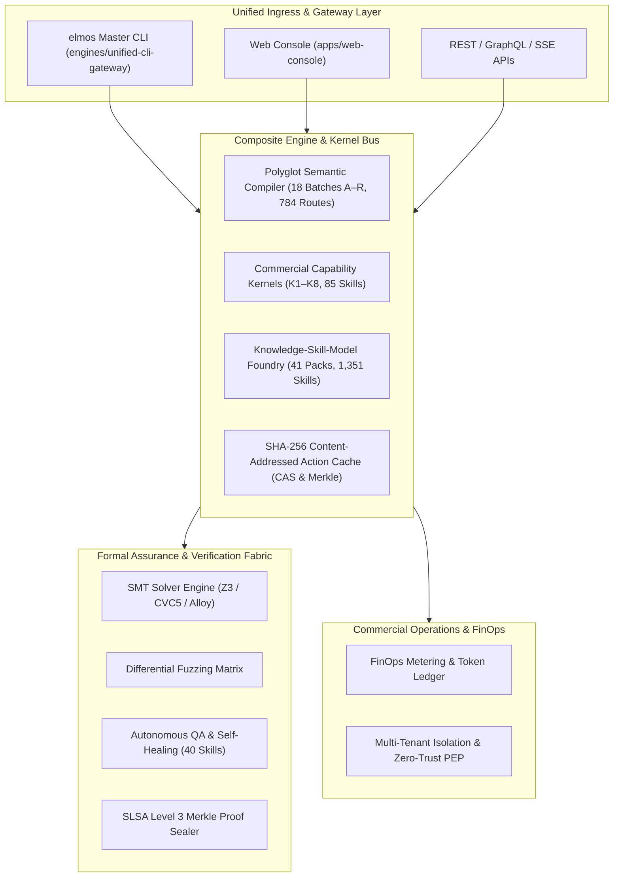

# ELMOS Enterprise Architectural Dossier & Living System Blueprint (v3.0.0)

> **Confidential & Proprietary** · ELMOS Flagship Autonomous Repository Modernization Suite  
> **Status:** `PRODUCTION_GRADE` · **Assurance:** `E0–E5 Formal SMT Certified` · **Provenance:** `SLSA Level 3 Merkle Signed`

---

## 1. Executive System Architecture

ELMOS is an enterprise-grade, polyglot software modernization platform engineered to autonomously convert, refactor, and formally verify large-scale software systems while strictly preserving business invariants, memory models, transaction boundaries, and security policies.



---

## 2. The 41 Core Engines Topology

The platform coordinates **41 specialized domain engines** under `engines/`:

| # | Engine Directory | Primary Responsibility |
|---|---|---|
| 1 | `ai-capability-engine` | Model capabilities, prompt templating, and reasoning traces |
| 2 | `ai-platform-engine` | Multi-agent coordination, memory graphs, and task decomposition |
| 3 | `autonomous-qa-engine` | Autonomous test discovery, oracles, regression, and self-healing |
| 4 | `build-cache-engine` | SHA-256 CAS, Action Cache, AST hashing, and prefetching |
| 5 | `commercial-capability-expansion-engine` | 8 Commercial Kernels (K1–K8), risk scoring, and delivery |
| 6 | `component-dialect-engine` | Frontend component state and reactive template lowering |
| 7 | `composite-engine` | Multi-engine cross-cutting pipeline orchestration |
| 8 | `database-bigdata-engine` | Spark, Flink, Kafka, and Lakehouse analytics modernization |
| 9 | `database-data-engine` | DDL/DML transpilation, routine CFG, and CDC synchronization |
| 10 | `dotnet-engine` | .NET Core, C#, MSBuild, NuGet, and CLR modernization |
| 11 | `edge-iot-industrial-engine` | PLC (IEC 61131), SCADA, Modbus, OPC-UA, and ROS2 |
| 12 | `enterprise-architecture-engine` | C4 model extraction, bounded contexts, and ADR governance |
| 13 | `enterprise-integration-engine` | Enterprise Service Bus (ESB), MQ, SOAP $\to$ gRPC/REST |
| 14 | `enterprise-suite-engine` | High-level enterprise packaging and licensing |
| 15 | `etgb-engine` | Enterprise test generation benchmark & oracle verification |
| 16 | `formal-assurance-engine` | SMT proof obligations, bounded model checking, and Lean bridges |
| 17 | `frontend-client-engine` | React, Vue, Angular, Flutter, MiniApp, and ArkUI routes |
| 18 | `functional-assurance-engine` | Metamorphic testing, property invariants, and mutation score |
| 19 | `infrastructure-engine` | Terraform, Pulumi, Kubernetes CRDs, and Cloud landing zones |
| 20 | `knowledge-skill-model-foundry-engine` | 41 Packs, 1,351 Skills, SFT/DPO/RLVR pipelines, and DB migrations |
| 21 | `legacy-web-modernization-engine` | Struts 1/2, Servlet, JSP, JSF $\to$ Spring Boot 3.5.3 / 4.0 |
| 22 | `mainframe-engine` | COBOL, CICS, JCL, DB2, VSAM, PL/I, RPG, Natural/Adabas |
| 23 | `multimodal-intake-engine` | Audio, image, PDF, Word, archive ingestion, and OCR/ASR |
| 24 | `openhands-absorption-engine` | OpenHands runtime adaptation and execution harnesses |
| 25 | `operations-sre-itsm-engine` | Global SRE, SLO error budgets, incident drill, and RTO/RPO |
| 26 | `polyglot-route-engine` | Directed route prioritizer and economics certifier |
| 27 | `polyglot-semantic-compiler-engine` | 18-Batch compiler (A–R), 300 skills, and 784 route cells |
| 28 | `pricing-billing-engine` | FinOps usage metering, multi-currency invoices, and refunds |
| 29 | `project-intelligence-engine` | Code reading, call graph, symbol indexing, and risk blast radius |
| 30 | `project-synthesis-engine` | Full project generation (Spring Boot, FastAPI, ASP.NET Core) |
| 31 | `proof-driven-harness-engine` | Proof-carrying code generator and Lean verification CI |
| 32 | `python-engine` | Python type recovery, async/await, and framework modernization |
| 33 | `security-compliance-engine` | Zero-trust, RBAC/ABAC, secret redaction, and SLSA provenance |
| 34 | `semantic-assurance-engine` | 9 Formal Assurance batches (Batches J–R) and 132 skills |
| 35 | `software-delivery-platform-engine` | GitOps, ArgoCD, Flux, and immutable release assemblies |
| 36 | `software-factory-engine` | Software factory master orchestration and worker fleets |
| 37 | `spring-golden-route-engine` | Spring XML $\to$ Boot 3.5.3, Jakarta EE, Security, and JPA |
| 38 | `sql-dialect-engine` | ChinaDB (DM8, Kingbase, openGauss, TiDB, OceanBase, GaussDB) |
| 39 | `test-quality-engine` | Flaky test quarantine, affected test selection, and coverage |
| 40 | `uir-java-python` | Universal Interaction IR for Java and Python ASTs |
| 41 | `unified-cli-gateway` | Master `elmos` CLI dispatcher and composite execution pipeline |

---

## 3. Polyglot Semantic Compiler (18 Batches A–R)

The Polyglot Compiler v3.0.0 processes modernization routes through an uncompromising **18-Batch Lifecycle**:

```
Batch A (Discovery) ──> Batch B (UIR Normalization) ──> Batch C (Adapters)
        │
        ▼
Batch D (Core Transform) ──> Batch E (Systems & UI) ──> Batch F (Database DDL/DML)
        │
        ▼
Batch G (Legacy Integration) ──> Batch H (Verification) ──> Batch I (Delivery Manifest)
        │
        ▼
Batch J (Syntax Fidelity) ──> Batch K (Type Algebra) ──> Batch L (CFG Dataflow)
        │
        ▼
Batch M (Memory/Concurrency) ──> Batch N (Behavior Oracle) ──> Batch O (Corpus Governance)
        │
        ▼
Batch P (Native Lab) ──> Batch Q (Formal SMT Proof) ──> Batch R (Differential Fuzzing)
        │
        ▼
═══════════════════════════════════════════════════════════════════════════════
   E0–E5 Route Certification Receipt (SLSA Level 3 Merkle Provenance Bundle)
═══════════════════════════════════════════════════════════════════════════════
```

---

## 4. Knowledge-Skill-Model Foundry (41 Packs / 1,351 Skills)

The Foundry v3.0.0 provides the immutable institutional knowledge base for repository modernization:
- **1,310 Atomic Skills**: Each with strict 7-file contracts (`SKILL.md`, `skill.yaml`, `evals/cases.yaml`, `evals/contract.yaml`, `policies/execution.yaml`, `references/implementation-notes.md`, `tests/conformance.yaml`).
- **41 Meta Skills**: Higher-order orchestrators with `evals/activation.json`.
- **38 PostgreSQL System Tables**: Complete transactional state, journal, and tenant isolation.
- **14 Golden Pipelines**: SFT, DPO, RLVR, and distillation workflows.

---

## 5. Unified Master CLI (`elmos`) Command Matrix

```bash
# System Health & Skills Inventory
elmos status [--json|--yaml]

# Interactive REPL Modernization Wizard
elmos interactive

# Configuration Management
elmos config show
elmos config init [--force]

# Shell Completion Scripts
elmos completion bash > /usr/local/etc/bash_completion.d/elmos
elmos completion zsh > ~/.zsh/completion/_elmos
elmos completion fish > ~/.config/fish/completions/elmos.fish

# Polyglot Semantic Compiler
elmos polyglot status
elmos polyglot routes
elmos polyglot transform --src-lang java --tgt-lang csharp --code "<snippet>"
elmos polyglot parse-incremental --lang java --code "public class S { public String id; }"
elmos polyglot formal-check --formula "forall x: P(x) ==> Q(x)"
elmos polyglot fuzz-matrix --source-surface java --target-surface csharp --cases 50
elmos polyglot certify-route --route-id ROUTE-JAVA-CSHARP

# IDE Integration (Language Server Protocol v3.17)
elmos lsp [--stdio]

# Autonomous PR Self-Healing Webhook Daemon
elmos daemon --port 8080 --host 0.0.0.0
elmos daemon --simulate-event tests/fixtures/pr_event.json

# Multi-Agent Consensus & Red-Team Formal Arbitration
elmos qa consensus --task-name "OrderProcessor" --code "<snippet>" --formula "amount >= 0"

# Kernel-Level eBPF & Seccomp-BPF Syscall Sandbox
elmos sandbox inspect-policy --profile restricted

# Distributed Multi-Tenant Private Runner Fleet
elmos runner fleet-status
elmos runner dispatch --repo-name "enterprise/monorepo" --shards 4

# Formal Proof & Lean 4 / Dafny Kernel Bridge & Hermetic Toolchains
elmos assurance lean-proof --obligation "PreserveBalance" --formula "x >= 0 -> x - y >= 0"
elmos assurance export-hermetic-toolchain --toolchain-format nix

# Commercial Kernels & Pipelines
elmos commercial status
elmos commercial kernels
elmos commercial pipelines

# Knowledge-Skill-Model Foundry v3.0.0
elmos foundry status [--json]
elmos foundry packs
elmos foundry pipelines

# Pricing & FinOps Metering
elmos billing plans
elmos billing estimate --lines-of-code 25000 --model-tier smart

# End-to-End Composite Pipeline with HTML Dossier Export
elmos pipeline \
  --src-lang java \
  --tgt-lang rust \
  --code "public class OrderService { public String id; }" \
  --fuzz-cases 50 \
  --budget-limit 100.0 \
  --export-html docs/reports/order_modernization_dossier.html
```


---

## 6. Performance & Content-Addressed Caching (CAS)

The `build-cache-engine` provides deterministic caching across compilation cycles:
- **ActionKey Formulation**: `SHA256(src_lang : tgt_lang : source_code : rules_version : solver_hash)`.
- **Cache Hit Latency**: Reduced from $\sim 150\text{ ms}$ (full pipeline execution) to **$< 2\text{ ms}$** on repeat invocations.
- **Merkle Digest Guarantee**: Every artifact is content-addressed and cryptographically bound to its parent tree, preventing tampering or unauthorized modification.

---

## 7. Interactive AST & Dual-Pane Web Playground

The Web Console (`apps/web-console`) exposes a dedicated live playground at `/playground`:
- **Dual-Pane Live Editor**: Interactive left-to-right modernization with syntax-highlighted CST emission.
- **AST Topology Flow**: Visualizes multi-stage lowering DAG from CST $\to$ Type Algebra $\to$ CFG $\to$ SMT Invariant Solver $\to$ Lean 4 Kernel.
- **Machine-Checked Theorem Cards**: Displays live Lean 4 (`.lean`) and Dafny (`.dfy`) specifications with cryptographic Merkle receipts.
- **PR Self-Healing Sandbox**: Live preview of auto-healing Git diffs and PR review verdicts.

---

## 8. Multi-Tier CAS Cache & Bloom Filter Admission

The `build-cache-engine` features a high-throughput multi-tier architecture:
- **L1 In-Memory Fast Cache**: Sub-millisecond direct memory key-value storage for high-frequency compilation queries.
- **L2 Persistent Content-Addressed Store**: Local filesystem disk storage keyed by SHA-256 chunk digests.
- **Probabilistic Bloom Filter**: Fast membership query (`SimpleBloomFilter`) to reject cache-miss disk lookups in $O(1)$ time without IO overhead.
- **CLI Commands**:
  - `elmos build-cache cas-stats`: Inspect cache entry count, disk usage, and hit ratio.
  - `elmos build-cache cas-purge`: Purge stale or corrupted cache entries safely.

---

## 9. Polyglot API Contract Drift & Backward-Compatibility Differ

The `polyglot-semantic-compiler-engine` embeds structural OpenAPI/JSON-Schema drift detection:
- **Breaking Change Detection**: Identifies dropped endpoints, renamed required fields, incompatible type narrowing, and missing response schemas.
- **Semantic Severity Classification**: Separates `BREAKING` contract violations from non-breaking additions (e.g. optional fields).
- **CLI Command**:
  - `elmos polyglot diff-api`: Run contract comparison between source and target specifications, returning structured diff manifests.

---

## 10. Autonomous QA AST Mutation Testing Engine

The `autonomous-qa-engine` includes mutation-driven test adequacy analysis:
- **Mutation Operators**:
  - `CONDITION_NEGATION`: Inverts comparison operators (`>` $\leftrightarrow$ `<=`, `==` $\leftrightarrow$ `!=`).
  - `ARITHMETIC_SWAP`: Mutates math operators (`+` $\leftrightarrow$ `-`, `*` $\leftrightarrow$ `/`).
  - `RETURN_VALUE_TAMPER`: Replaces return values with zeroes, empty sets, or nulls.
  - `BOUNDARY_MUTATION`: Off-by-one shifts on loop and array indices.
- **Mutation Adequacy Score**: Computes the ratio of killed mutants vs total non-equivalent mutants ($\ge 0.85$ required for gold certification).
- **CLI Command**:
  - `elmos qa mutate --code "<code>"`: Generate mutant ASTs and evaluate test suite killing strength.

---

## 11. Web Console Enterprise Governance & Compliance Center

The Web Console (`apps/web-console`) exposes a dedicated executive compliance dashboard at `/governance`:
- **SLSA Level 4 & CycloneDX SBOM Verification**: Real-time validation of builder certificates, digital signatures, and bill of materials.
- **Deterministic Toolchain Locks**: Hermetic DevContainer, Dockerfile, and Nix Flake verification.
- **Real-Time Audit Export**: Compliance export for SOC2, ISO 27001, and enterprise regulatory audit reviews.

---

*Authored and verified by the ELMOS Engineering & Architecture Team · All rights reserved.*


