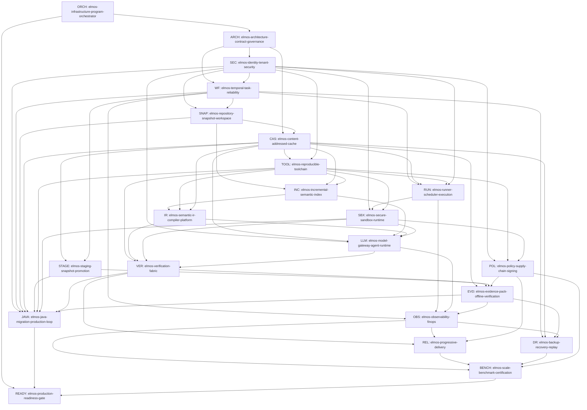

# Skill Dependency Graph

## Topological execution order

1. `elmos-infrastructure-program-orchestrator`
2. `elmos-architecture-contract-governance`
3. `elmos-identity-tenant-security`
4. `elmos-temporal-task-reliability`
5. `elmos-repository-snapshot-workspace`
6. `elmos-content-addressed-cache`
7. `elmos-reproducible-toolchain`
8. `elmos-staging-snapshot-promotion`
9. `elmos-incremental-semantic-index`
10. `elmos-runner-scheduler-execution`
11. `elmos-semantic-ir-compiler-platform`
12. `elmos-secure-sandbox-runtime`
13. `elmos-model-gateway-agent-runtime`
14. `elmos-policy-supply-chain-signing`
15. `elmos-verification-fabric`
16. `elmos-evidence-pack-offline-verification`
17. `elmos-java-migration-production-loop`
18. `elmos-observability-finops`
19. `elmos-backup-recovery-replay`
20. `elmos-progressive-delivery`
21. `elmos-scale-benchmark-certification`
22. `elmos-production-readiness-gate`
