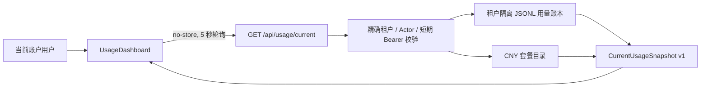

# 实时账户用量架构设计

| 项目 | 值 |
|---|---|
| 任务 | 实时显示用户 Token/Credit 消耗量与进度 |
| 状态 | `IMPLEMENTED_LOCAL_RUNTIME` |
| 套餐目录 | `2026-07-28.1` |
| 快照契约 | `1.0.0` |
| 生产计量源 | `NOT_CONFIGURED` |
| 外部认证、Neon 与生产运行证据 | `NOT_RUN` |

## 1. 目标

套餐页在用户提供短期、精确绑定的租户与 Actor 凭证后，读取当前额度周期内的
不可变用量事件，每 5 秒刷新 Token、Credit 已用量、剩余额度和消耗进度。

缺失、损坏、跨租户或未对账事件不得伪装成可信的零用量：

- `RECONCILED` 事件进入当前读数；
- `PENDING` 事件不计入已用量，快照标记为 `PARTIAL`；
- `REJECTED` 事件保留在账本中但不计入已用量；
- 账本不存在时 API 返回 `NOT_CONFIGURED`；
- 重复幂等键只允许完全相同的事件，冲突时失败关闭。

## 2. 组件与数据流

## 3. 客户端一致性

- 凭证只保存在 React 页面内存中，不写入 Cookie、localStorage、日志或 URL。
- GET 请求使用 `Cache-Control: private, no-store`，缓存隔离维度包含 Authorization、
  Tenant 和 Actor。
- 同一页面最多存在一个在途请求；新刷新会取消旧请求。
- 页面隐藏时暂停刷新，重新可见时立即同步。
- 401/403 和不可重试契约错误停止自动刷新；可重试的计量源/网络错误保留最近可信快照并标记 `STALE`。
- 进度采用整数基点 `usageBps`，权威数量使用安全整数，不用二进制浮点保存计量事实。

## 4. 安全边界

租户与用户身份必须同时匹配服务端配置；客户端自报头不能扩大凭证范围。
账本路径由服务端配置的根目录和已认证租户构造，并执行路径逃逸检查。
当前实现用于受控本地 Runner；生产身份提供商、共享数据库读模型及服务间凭证尚未配置，
因此不得宣称生产多用户计量已经上线。

## 5. 可访问性

- Token 与 Credit 使用原生 `progressbar` 语义；
- 提供 `aria-valuemin`、`aria-valuemax`、`aria-valuenow` 和完整中文 `aria-valuetext`；
- 同步、未对账和错误状态通过 `aria-live` 或 `role="alert"` 公布；
- `prefers-reduced-motion` 下禁用进度动画。

## 6. 主要实现

- `apps/web-console/app/lib/server/usageMeter.ts`
- `apps/web-console/app/lib/usageSnapshot.ts`
- `apps/web-console/app/api/usage/current/route.ts`
- `apps/web-console/app/pricing/UsageDashboard.tsx`
- `contracts/usage-schema/current-usage-snapshot.schema.json`
- `contracts/usage-schema/usage-ledger-event-v1.schema.json`
