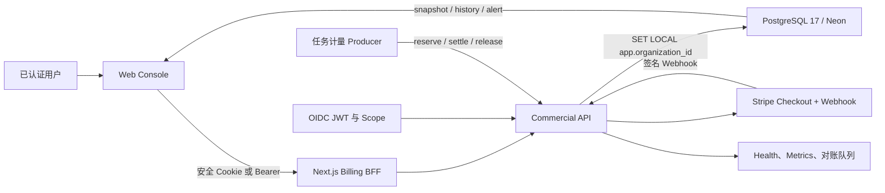
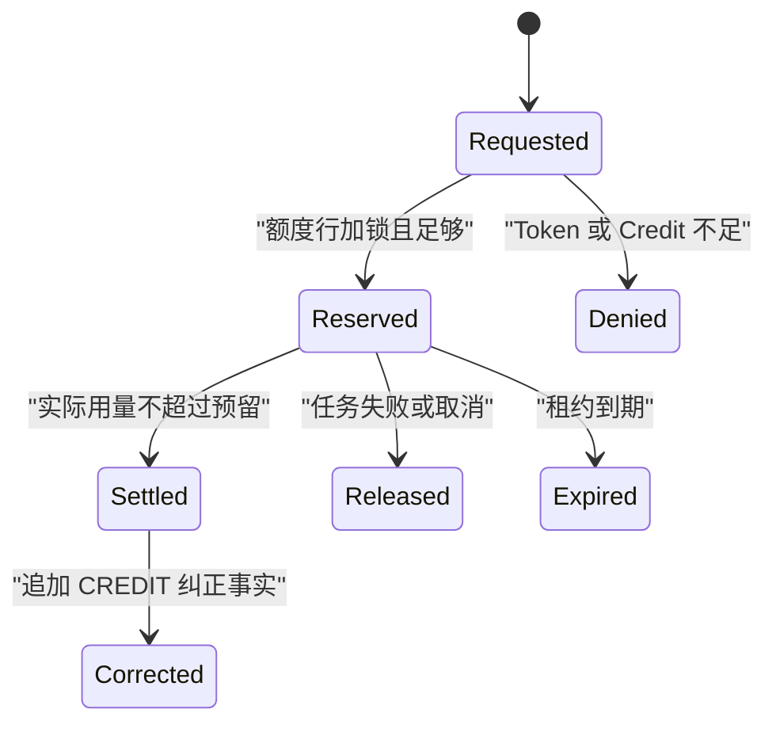

# 自助订阅、计量与实时用量架构

## 状态与边界

| 项目 | 当前状态 |
|---|---|
| 人民币套餐目录、Token/Credit 规则 | `IMPLEMENTED`，目录仍为 `DRAFT` |
| OAuth2/JWT 租户与权限边界 | `IMPLEMENTED_FAIL_CLOSED` |
| PostgreSQL 17 权威计量与订阅适配器 | `IMPLEMENTED_LOCAL_VERIFIED` |
| Web 实时用量、历史、告警、CSV | `IMPLEMENTED` |
| Stripe Checkout/Webhook 适配器 | `IMPLEMENTED_NOT_CONFIGURED` |
| Neon 生产迁移 | `NOT_RUN` |
| 税务、开票、商户主体、成本验证 | `NOT_CONFIGURED` / `NOT_RUN` |

## 目标

系统为一个已认证组织提供一次免费体验，以及人民币月付、年付订阅。所有计量先预留、
后结算；并发任务不能超卖额度。用户看到的已用、预留、剩余和进度均来自同一事务型
PostgreSQL 权威状态。未知、迟到或未对账的提供方结果保持显式，不得折算为零。

## 组件

## 信任与授权

- 组织 ID 仅从已验证 JWT 的 `organization_id` 获取；API 不接受客户端租户头。
- JWT 必须通过 issuer、JWK 与 audience 校验；任一项未配置时受保护路由返回 401。
- 读用量、导出、写告警、写计量、管理计费分别使用精确 scope。
- 数据库适配器在每个事务中设置 `app.organization_id`；所有计费新表启用并强制 RLS。
- Web BFF 只转发服务端读取的访问令牌，不记录令牌，不生成组织身份。

## 计量状态机

任务入口先预留固定操作 Credit 和最大 Runner 分钟；成功后按实际分钟和提供方确认的
Token 分类结算，失败则释放。相同幂等键只有完全相同的请求可以重放。

## 订阅与支付状态

- 免费体验：已验证邮箱或手机号经 HMAC 去标识化；组织与验证身份均只能领取一次。
- 免费体验到期：每次租户事务先执行到期转换，关闭试用订阅及额度。
- 付费：服务端选择受控 Stripe Price ID，客户端不能提交金额或币种。
- Webhook：先校验签名和时间窗，再校验目录版本、组织、套餐、币种和账期。
- 提供方结果未知或字段不完整：写入 `RECONCILIATION_REQUIRED`，不得重试为成功。
- 对账结案：仅 `commercial:billing:admin` 可查看并以外部证据引用结案，结案事件追加保存。

## 客户端实时行为

- 默认每 5 秒刷新，页面隐藏时暂停，恢复可见时立即同步。
- 同时显示 `consumed`、`reserved`、`remaining`、`usageBps` 与硬停止状态。
- 支持小时/日历史、预计耗尽时间、阈值告警、告警历史和 UTF-8 CSV 导出。
- 生产环境没有已认证会话时失败关闭；本地 JSONL 只在显式本地 Runner 开关下可用。

## 设计依据

价格与额度是 ELMOS 自有草案，不是复制竞争产品。能力结构参考了
[Cursor 定价文档](https://docs.cursor.com/account/pricing)、
[Cursor 用量定价说明](https://cursor.com/terms/pricing)与
[Windsurf/Devin 用量文档](https://docs.devin.ai/desktop/accounts/usage)。
支付流程遵循
[Stripe Checkout Session](https://docs.stripe.com/api/checkout/sessions?lang=java)和
[Stripe 订阅 Webhook](https://docs.stripe.com/payments/checkout/build-subscriptions?locale=en-GB)
的服务端创建与异步确认模式。资料核对日期为 2026-07-28。
