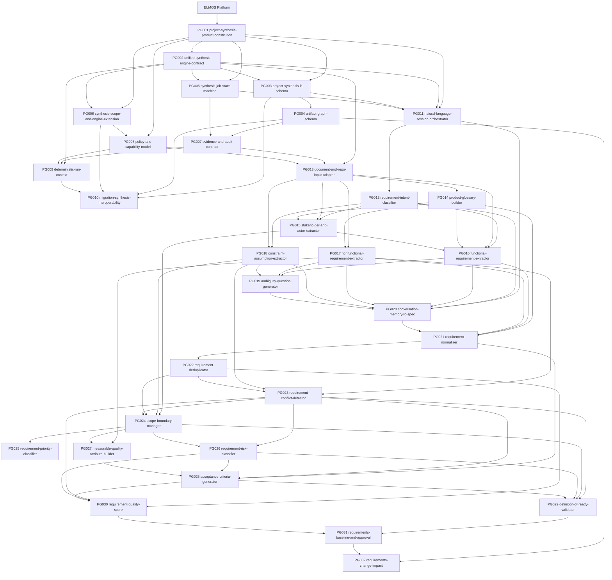

# Batch 46–48 Dependency Graph

```mermaid
graph TD
  ROOT["ELMOS Platform"] --> PG001["PG001 project-synthesis-product-constitution"]
  PG001 --> PG002["PG002 unified-synthesis-engine-contract"]
  PG001 --> PG003["PG003 project-synthesis-ir-schema"]
  PG002 --> PG003["PG003 project-synthesis-ir-schema"]
  PG003 --> PG004["PG004 artifact-graph-schema"]
  PG001 --> PG005["PG005 synthesis-job-state-machine"]
  PG002 --> PG005["PG005 synthesis-job-state-machine"]
  PG001 --> PG006["PG006 synthesis-scope-and-engine-extension"]
  PG002 --> PG006["PG006 synthesis-scope-and-engine-extension"]
  PG004 --> PG007["PG007 evidence-and-audit-contract"]
  PG005 --> PG007["PG007 evidence-and-audit-contract"]
  PG001 --> PG008["PG008 policy-and-capability-model"]
  PG006 --> PG008["PG008 policy-and-capability-model"]
  PG002 --> PG009["PG009 deterministic-run-context"]
  PG007 --> PG009["PG009 deterministic-run-context"]
  PG008 --> PG009["PG009 deterministic-run-context"]
  PG003 --> PG010["PG010 migration-synthesis-interoperability"]
  PG004 --> PG010["PG010 migration-synthesis-interoperability"]
  PG006 --> PG010["PG010 migration-synthesis-interoperability"]
  PG009 --> PG010["PG010 migration-synthesis-interoperability"]
  PG001 --> PG011["PG011 natural-language-session-orchestrator"]
  PG002 --> PG011["PG011 natural-language-session-orchestrator"]
  PG003 --> PG011["PG011 natural-language-session-orchestrator"]
  PG005 --> PG011["PG011 natural-language-session-orchestrator"]
  PG011 --> PG012["PG012 requirement-intent-classifier"]
  PG002 --> PG013["PG013 document-and-repo-input-adapter"]
  PG007 --> PG013["PG013 document-and-repo-input-adapter"]
  PG008 --> PG013["PG013 document-and-repo-input-adapter"]
  PG013 --> PG014["PG014 product-glossary-builder"]
  PG012 --> PG015["PG015 stakeholder-and-actor-extractor"]
  PG013 --> PG015["PG015 stakeholder-and-actor-extractor"]
  PG014 --> PG015["PG015 stakeholder-and-actor-extractor"]
  PG012 --> PG016["PG016 functional-requirement-extractor"]
  PG013 --> PG016["PG016 functional-requirement-extractor"]
  PG014 --> PG016["PG016 functional-requirement-extractor"]
  PG015 --> PG016["PG016 functional-requirement-extractor"]
  PG013 --> PG017["PG017 nonfunctional-requirement-extractor"]
  PG014 --> PG017["PG017 nonfunctional-requirement-extractor"]
  PG012 --> PG018["PG018 constraint-assumption-extractor"]
  PG013 --> PG018["PG018 constraint-assumption-extractor"]
  PG016 --> PG019["PG019 ambiguity-question-generator"]
  PG017 --> PG019["PG019 ambiguity-question-generator"]
  PG018 --> PG019["PG019 ambiguity-question-generator"]
  PG011 --> PG020["PG020 conversation-memory-to-spec"]
  PG012 --> PG020["PG020 conversation-memory-to-spec"]
  PG016 --> PG020["PG020 conversation-memory-to-spec"]
  PG017 --> PG020["PG020 conversation-memory-to-spec"]
  PG018 --> PG020["PG020 conversation-memory-to-spec"]
  PG019 --> PG020["PG020 conversation-memory-to-spec"]
  PG014 --> PG021["PG021 requirement-normalizer"]
  PG016 --> PG021["PG021 requirement-normalizer"]
  PG017 --> PG021["PG021 requirement-normalizer"]
  PG020 --> PG021["PG021 requirement-normalizer"]
  PG021 --> PG022["PG022 requirement-deduplicator"]
  PG017 --> PG023["PG023 requirement-conflict-detector"]
  PG018 --> PG023["PG023 requirement-conflict-detector"]
  PG022 --> PG023["PG023 requirement-conflict-detector"]
  PG015 --> PG024["PG024 scope-boundary-manager"]
  PG018 --> PG024["PG024 scope-boundary-manager"]
  PG022 --> PG024["PG024 scope-boundary-manager"]
  PG023 --> PG024["PG024 scope-boundary-manager"]
  PG024 --> PG025["PG025 requirement-priority-classifier"]
  PG023 --> PG026["PG026 requirement-risk-classifier"]
  PG024 --> PG026["PG026 requirement-risk-classifier"]
  PG017 --> PG027["PG027 measurable-quality-attribute-builder"]
  PG024 --> PG027["PG027 measurable-quality-attribute-builder"]
  PG021 --> PG028["PG028 acceptance-criteria-generator"]
  PG023 --> PG028["PG028 acceptance-criteria-generator"]
  PG026 --> PG028["PG028 acceptance-criteria-generator"]
  PG027 --> PG028["PG028 acceptance-criteria-generator"]
  PG023 --> PG029["PG029 definition-of-ready-validator"]
  PG024 --> PG029["PG029 definition-of-ready-validator"]
  PG026 --> PG029["PG029 definition-of-ready-validator"]
  PG028 --> PG029["PG029 definition-of-ready-validator"]
  PG022 --> PG030["PG030 requirement-quality-score"]
  PG023 --> PG030["PG030 requirement-quality-score"]
  PG026 --> PG030["PG030 requirement-quality-score"]
  PG028 --> PG030["PG030 requirement-quality-score"]
  PG029 --> PG031["PG031 requirements-baseline-and-approval"]
  PG030 --> PG031["PG031 requirements-baseline-and-approval"]
  PG004 --> PG032["PG032 requirements-change-impact"]
  PG031 --> PG032["PG032 requirements-change-impact"]
```
