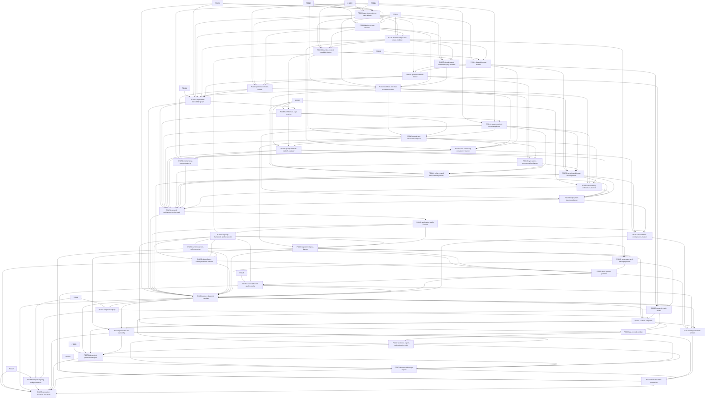

# Batch 49–52 Dependency Graph

```mermaid
graph TD
  PG015 --> PG033["PG033 user-story-and-use-case-builder"]
  PG024 --> PG033["PG033 user-story-and-use-case-builder"]
  PG028 --> PG033["PG033 user-story-and-use-case-builder"]
  PG031 --> PG033["PG033 user-story-and-use-case-builder"]
  PG014 --> PG034["PG034 business-rule-modeler"]
  PG028 --> PG034["PG034 business-rule-modeler"]
  PG031 --> PG034["PG034 business-rule-modeler"]
  PG033 --> PG034["PG034 business-rule-modeler"]
  PG014 --> PG035["PG035 domain-entity-value-object-modeler"]
  PG033 --> PG035["PG035 domain-entity-value-object-modeler"]
  PG034 --> PG035["PG035 domain-entity-value-object-modeler"]
  PG014 --> PG036["PG036 bounded-context-candidate-builder"]
  PG015 --> PG036["PG036 bounded-context-candidate-builder"]
  PG034 --> PG036["PG036 bounded-context-candidate-builder"]
  PG035 --> PG036["PG036 bounded-context-candidate-builder"]
  PG033 --> PG037["PG037 domain-event-command-query-modeler"]
  PG034 --> PG037["PG037 domain-event-command-query-modeler"]
  PG035 --> PG037["PG037 domain-event-command-query-modeler"]
  PG036 --> PG037["PG037 domain-event-command-query-modeler"]
  PG028 --> PG038["PG038 workflow-and-state-machine-modeler"]
  PG033 --> PG038["PG038 workflow-and-state-machine-modeler"]
  PG034 --> PG038["PG038 workflow-and-state-machine-modeler"]
  PG037 --> PG038["PG038 workflow-and-state-machine-modeler"]
  PG014 --> PG039["PG039 data-dictionary-builder"]
  PG018 --> PG039["PG039 data-dictionary-builder"]
  PG035 --> PG039["PG039 data-dictionary-builder"]
  PG033 --> PG040["PG040 api-contract-draft-builder"]
  PG037 --> PG040["PG040 api-contract-draft-builder"]
  PG039 --> PG040["PG040 api-contract-draft-builder"]
  PG015 --> PG041["PG041 permission-matrix-builder"]
  PG033 --> PG041["PG041 permission-matrix-builder"]
  PG034 --> PG041["PG041 permission-matrix-builder"]
  PG040 --> PG041["PG041 permission-matrix-builder"]
  PG004 --> PG042["PG042 requirement-traceability-graph"]
  PG031 --> PG042["PG042 requirement-traceability-graph"]
  PG033 --> PG042["PG042 requirement-traceability-graph"]
  PG034 --> PG042["PG042 requirement-traceability-graph"]
  PG035 --> PG042["PG042 requirement-traceability-graph"]
  PG038 --> PG042["PG042 requirement-traceability-graph"]
  PG040 --> PG042["PG042 requirement-traceability-graph"]
  PG041 --> PG042["PG042 requirement-traceability-graph"]
  PG027 --> PG043["PG043 architecture-style-selector"]
  PG036 --> PG043["PG043 architecture-style-selector"]
  PG042 --> PG043["PG043 architecture-style-selector"]
  PG015 --> PG044["PG044 system-context-container-planner"]
  PG024 --> PG044["PG044 system-context-container-planner"]
  PG043 --> PG044["PG044 system-context-container-planner"]
  PG036 --> PG045["PG045 module-and-service-decomposer"]
  PG038 --> PG045["PG045 module-and-service-decomposer"]
  PG043 --> PG045["PG045 module-and-service-decomposer"]
  PG044 --> PG045["PG045 module-and-service-decomposer"]
  PG027 --> PG046["PG046 quality-attribute-tradeoff-analyzer"]
  PG043 --> PG046["PG046 quality-attribute-tradeoff-analyzer"]
  PG045 --> PG046["PG046 quality-attribute-tradeoff-analyzer"]
  PG035 --> PG047["PG047 data-ownership-consistency-planner"]
  PG038 --> PG047["PG047 data-ownership-consistency-planner"]
  PG039 --> PG047["PG047 data-ownership-consistency-planner"]
  PG045 --> PG047["PG047 data-ownership-consistency-planner"]
  PG038 --> PG048["PG048 sync-async-communication-planner"]
  PG040 --> PG048["PG048 sync-async-communication-planner"]
  PG045 --> PG048["PG048 sync-async-communication-planner"]
  PG046 --> PG048["PG048 sync-async-communication-planner"]
  PG027 --> PG049["PG049 resilience-and-failure-mode-planner"]
  PG038 --> PG049["PG049 resilience-and-failure-mode-planner"]
  PG044 --> PG049["PG049 resilience-and-failure-mode-planner"]
  PG048 --> PG049["PG049 resilience-and-failure-mode-planner"]
  PG039 --> PG050["PG050 security-and-threat-model-planner"]
  PG041 --> PG050["PG050 security-and-threat-model-planner"]
  PG044 --> PG050["PG050 security-and-threat-model-planner"]
  PG048 --> PG050["PG050 security-and-threat-model-planner"]
  PG024 --> PG051["PG051 multitenancy-topology-planner"]
  PG041 --> PG051["PG051 multitenancy-topology-planner"]
  PG046 --> PG051["PG051 multitenancy-topology-planner"]
  PG047 --> PG051["PG051 multitenancy-topology-planner"]
  PG027 --> PG052["PG052 observability-architecture-planner"]
  PG038 --> PG052["PG052 observability-architecture-planner"]
  PG044 --> PG052["PG052 observability-architecture-planner"]
  PG045 --> PG052["PG052 observability-architecture-planner"]
  PG050 --> PG052["PG052 observability-architecture-planner"]
  PG044 --> PG053["PG053 deployment-topology-planner"]
  PG046 --> PG053["PG053 deployment-topology-planner"]
  PG049 --> PG053["PG053 deployment-topology-planner"]
  PG050 --> PG053["PG053 deployment-topology-planner"]
  PG052 --> PG053["PG053 deployment-topology-planner"]
  PG042 --> PG054["PG054 adr-and-architecture-review-pack"]
  PG043 --> PG054["PG054 adr-and-architecture-review-pack"]
  PG044 --> PG054["PG054 adr-and-architecture-review-pack"]
  PG045 --> PG054["PG054 adr-and-architecture-review-pack"]
  PG046 --> PG054["PG054 adr-and-architecture-review-pack"]
  PG047 --> PG054["PG054 adr-and-architecture-review-pack"]
  PG048 --> PG054["PG054 adr-and-architecture-review-pack"]
  PG049 --> PG054["PG054 adr-and-architecture-review-pack"]
  PG050 --> PG054["PG054 adr-and-architecture-review-pack"]
  PG051 --> PG054["PG054 adr-and-architecture-review-pack"]
  PG052 --> PG054["PG054 adr-and-architecture-review-pack"]
  PG053 --> PG054["PG054 adr-and-architecture-review-pack"]
  PG054 --> PG055["PG055 application-profile-selector"]
  PG018 --> PG056["PG056 language-framework-profile-selector"]
  PG055 --> PG056["PG056 language-framework-profile-selector"]
  PG056 --> PG057["PG057 runtime-version-policy-resolver"]
  PG050 --> PG058["PG058 dependency-catalog-and-bom-planner"]
  PG056 --> PG058["PG058 dependency-catalog-and-bom-planner"]
  PG057 --> PG058["PG058 dependency-catalog-and-bom-planner"]
  PG045 --> PG059["PG059 repository-layout-planner"]
  PG055 --> PG059["PG059 repository-layout-planner"]
  PG056 --> PG059["PG059 repository-layout-planner"]
  PG035 --> PG060["PG060 namespace-and-package-planner"]
  PG056 --> PG060["PG060 namespace-and-package-planner"]
  PG059 --> PG060["PG060 namespace-and-package-planner"]
  PG057 --> PG061["PG061 build-system-planner"]
  PG058 --> PG061["PG061 build-system-planner"]
  PG059 --> PG061["PG061 build-system-planner"]
  PG060 --> PG061["PG061 build-system-planner"]
  PG047 --> PG062["PG062 environment-configuration-planner"]
  PG050 --> PG062["PG062 environment-configuration-planner"]
  PG053 --> PG062["PG062 environment-configuration-planner"]
  PG055 --> PG062["PG062 environment-configuration-planner"]
  PG026 --> PG063["PG063 code-style-and-quality-profile"]
  PG056 --> PG063["PG063 code-style-and-quality-profile"]
  PG061 --> PG063["PG063 code-style-and-quality-profile"]
  PG031 --> PG064["PG064 project-blueprint-compiler"]
  PG042 --> PG064["PG064 project-blueprint-compiler"]
  PG054 --> PG064["PG064 project-blueprint-compiler"]
  PG055 --> PG064["PG064 project-blueprint-compiler"]
  PG056 --> PG064["PG064 project-blueprint-compiler"]
  PG057 --> PG064["PG064 project-blueprint-compiler"]
  PG058 --> PG064["PG064 project-blueprint-compiler"]
  PG059 --> PG064["PG064 project-blueprint-compiler"]
  PG060 --> PG064["PG064 project-blueprint-compiler"]
  PG061 --> PG064["PG064 project-blueprint-compiler"]
  PG062 --> PG064["PG064 project-blueprint-compiler"]
  PG063 --> PG064["PG064 project-blueprint-compiler"]
  PG008 --> PG065["PG065 template-registry"]
  PG064 --> PG065["PG065 template-registry"]
  PG007 --> PG066["PG066 template-signing-and-provenance"]
  PG008 --> PG066["PG066 template-signing-and-provenance"]
  PG065 --> PG066["PG066 template-signing-and-provenance"]
  PG037 --> PG067["PG067 semantic-code-model"]
  PG040 --> PG067["PG067 semantic-code-model"]
  PG060 --> PG067["PG067 semantic-code-model"]
  PG064 --> PG067["PG067 semantic-code-model"]
  PG059 --> PG068["PG068 scaffold-composer"]
  PG064 --> PG068["PG068 scaffold-composer"]
  PG065 --> PG068["PG068 scaffold-composer"]
  PG067 --> PG068["PG068 scaffold-composer"]
  PG056 --> PG069["PG069 ast-cst-code-emitter"]
  PG067 --> PG069["PG069 ast-cst-code-emitter"]
  PG068 --> PG069["PG069 ast-cst-code-emitter"]
  PG061 --> PG070["PG070 configuration-file-emitter"]
  PG062 --> PG070["PG070 configuration-file-emitter"]
  PG063 --> PG070["PG070 configuration-file-emitter"]
  PG064 --> PG070["PG070 configuration-file-emitter"]
  PG068 --> PG070["PG070 configuration-file-emitter"]
  PG059 --> PG071["PG071 generated-file-ownership"]
  PG064 --> PG071["PG071 generated-file-ownership"]
  PG068 --> PG071["PG071 generated-file-ownership"]
  PG067 --> PG072["PG072 protected-region-and-extension-point"]
  PG069 --> PG072["PG072 protected-region-and-extension-point"]
  PG071 --> PG072["PG072 protected-region-and-extension-point"]
  PG009 --> PG073["PG073 idempotent-generation-engine"]
  PG064 --> PG073["PG073 idempotent-generation-engine"]
  PG068 --> PG073["PG073 idempotent-generation-engine"]
  PG071 --> PG073["PG073 idempotent-generation-engine"]
  PG072 --> PG073["PG073 idempotent-generation-engine"]
  PG032 --> PG074["PG074 incremental-merge-engine"]
  PG069 --> PG074["PG074 incremental-merge-engine"]
  PG071 --> PG074["PG074 incremental-merge-engine"]
  PG072 --> PG074["PG074 incremental-merge-engine"]
  PG073 --> PG074["PG074 incremental-merge-engine"]
  PG057 --> PG075["PG075 formatter-linter-normalizer"]
  PG063 --> PG075["PG075 formatter-linter-normalizer"]
  PG069 --> PG075["PG075 formatter-linter-normalizer"]
  PG070 --> PG075["PG075 formatter-linter-normalizer"]
  PG074 --> PG075["PG075 formatter-linter-normalizer"]
  PG007 --> PG076["PG076 generation-manifest-and-sbom"]
  PG058 --> PG076["PG076 generation-manifest-and-sbom"]
  PG064 --> PG076["PG076 generation-manifest-and-sbom"]
  PG066 --> PG076["PG076 generation-manifest-and-sbom"]
  PG071 --> PG076["PG076 generation-manifest-and-sbom"]
  PG073 --> PG076["PG076 generation-manifest-and-sbom"]
  PG074 --> PG076["PG076 generation-manifest-and-sbom"]
  PG075 --> PG076["PG076 generation-manifest-and-sbom"]
```
