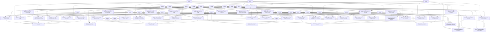

# Dependency Graph

```mermaid
graph TD
  PG056 --> PG077["PG077 java-spring-boot-service-profile"]
  PG057 --> PG077["PG077 java-spring-boot-service-profile"]
  PG058 --> PG077["PG077 java-spring-boot-service-profile"]
  PG064 --> PG077["PG077 java-spring-boot-service-profile"]
  PG076 --> PG077["PG077 java-spring-boot-service-profile"]
  PG045 --> PG078["PG078 java-modular-monolith-profile"]
  PG054 --> PG078["PG078 java-modular-monolith-profile"]
  PG064 --> PG078["PG078 java-modular-monolith-profile"]
  PG077 --> PG078["PG078 java-modular-monolith-profile"]
  PG045 --> PG079["PG079 java-microservice-profile"]
  PG048 --> PG079["PG079 java-microservice-profile"]
  PG053 --> PG079["PG079 java-microservice-profile"]
  PG064 --> PG079["PG079 java-microservice-profile"]
  PG077 --> PG079["PG079 java-microservice-profile"]
  PG038 --> PG080["PG080 java-cli-batch-worker-profile"]
  PG053 --> PG080["PG080 java-cli-batch-worker-profile"]
  PG057 --> PG080["PG080 java-cli-batch-worker-profile"]
  PG064 --> PG080["PG080 java-cli-batch-worker-profile"]
  PG040 --> PG081["PG081 java-rest-controller-generator"]
  PG041 --> PG081["PG081 java-rest-controller-generator"]
  PG067 --> PG081["PG081 java-rest-controller-generator"]
  PG077 --> PG081["PG081 java-rest-controller-generator"]
  PG035 --> PG082["PG082 java-domain-application-layer-generator"]
  PG037 --> PG082["PG082 java-domain-application-layer-generator"]
  PG067 --> PG082["PG082 java-domain-application-layer-generator"]
  PG072 --> PG082["PG082 java-domain-application-layer-generator"]
  PG077 --> PG082["PG082 java-domain-application-layer-generator"]
  PG035 --> PG083["PG083 java-jpa-jdbc-persistence-generator"]
  PG047 --> PG083["PG083 java-jpa-jdbc-persistence-generator"]
  PG067 --> PG083["PG083 java-jpa-jdbc-persistence-generator"]
  PG077 --> PG083["PG083 java-jpa-jdbc-persistence-generator"]
  PG113 --> PG083["PG083 java-jpa-jdbc-persistence-generator"]
  PG041 --> PG084["PG084 java-security-authz-generator"]
  PG050 --> PG084["PG084 java-security-authz-generator"]
  PG062 --> PG084["PG084 java-security-authz-generator"]
  PG077 --> PG084["PG084 java-security-authz-generator"]
  PG048 --> PG085["PG085 java-messaging-scheduler-generator"]
  PG049 --> PG085["PG085 java-messaging-scheduler-generator"]
  PG077 --> PG085["PG085 java-messaging-scheduler-generator"]
  PG117 --> PG085["PG085 java-messaging-scheduler-generator"]
  PG122 --> PG085["PG085 java-messaging-scheduler-generator"]
  PG058 --> PG086["PG086 java-maven-gradle-build-generator"]
  PG061 --> PG086["PG086 java-maven-gradle-build-generator"]
  PG063 --> PG086["PG086 java-maven-gradle-build-generator"]
  PG077 --> PG086["PG086 java-maven-gradle-build-generator"]
  PG028 --> PG087["PG087 java-test-fixture-generator"]
  PG042 --> PG087["PG087 java-test-fixture-generator"]
  PG078 --> PG087["PG087 java-test-fixture-generator"]
  PG081 --> PG087["PG087 java-test-fixture-generator"]
  PG082 --> PG087["PG087 java-test-fixture-generator"]
  PG083 --> PG087["PG087 java-test-fixture-generator"]
  PG084 --> PG087["PG087 java-test-fixture-generator"]
  PG085 --> PG087["PG087 java-test-fixture-generator"]
  PG053 --> PG088["PG088 java-container-deployment-generator"]
  PG062 --> PG088["PG088 java-container-deployment-generator"]
  PG070 --> PG088["PG088 java-container-deployment-generator"]
  PG086 --> PG088["PG088 java-container-deployment-generator"]
  PG056 --> PG089["PG089 python-fastapi-service-profile"]
  PG057 --> PG089["PG089 python-fastapi-service-profile"]
  PG058 --> PG089["PG089 python-fastapi-service-profile"]
  PG064 --> PG089["PG089 python-fastapi-service-profile"]
  PG076 --> PG089["PG089 python-fastapi-service-profile"]
  PG056 --> PG090["PG090 python-django-web-profile"]
  PG057 --> PG090["PG090 python-django-web-profile"]
  PG058 --> PG090["PG090 python-django-web-profile"]
  PG064 --> PG090["PG090 python-django-web-profile"]
  PG038 --> PG091["PG091 python-cli-worker-profile"]
  PG053 --> PG091["PG091 python-cli-worker-profile"]
  PG057 --> PG091["PG091 python-cli-worker-profile"]
  PG064 --> PG091["PG091 python-cli-worker-profile"]
  PG050 --> PG092["PG092 python-data-ai-service-profile"]
  PG057 --> PG092["PG092 python-data-ai-service-profile"]
  PG064 --> PG092["PG092 python-data-ai-service-profile"]
  PG035 --> PG093["PG093 python-domain-application-layer-generator"]
  PG037 --> PG093["PG093 python-domain-application-layer-generator"]
  PG067 --> PG093["PG093 python-domain-application-layer-generator"]
  PG072 --> PG093["PG093 python-domain-application-layer-generator"]
  PG089 --> PG093["PG093 python-domain-application-layer-generator"]
  PG039 --> PG094["PG094 python-pydantic-api-contract-generator"]
  PG040 --> PG094["PG094 python-pydantic-api-contract-generator"]
  PG041 --> PG094["PG094 python-pydantic-api-contract-generator"]
  PG089 --> PG094["PG094 python-pydantic-api-contract-generator"]
  PG035 --> PG095["PG095 python-sqlalchemy-django-orm-generator"]
  PG047 --> PG095["PG095 python-sqlalchemy-django-orm-generator"]
  PG089 --> PG095["PG095 python-sqlalchemy-django-orm-generator"]
  PG090 --> PG095["PG095 python-sqlalchemy-django-orm-generator"]
  PG113 --> PG095["PG095 python-sqlalchemy-django-orm-generator"]
  PG041 --> PG096["PG096 python-auth-permission-generator"]
  PG050 --> PG096["PG096 python-auth-permission-generator"]
  PG062 --> PG096["PG096 python-auth-permission-generator"]
  PG089 --> PG096["PG096 python-auth-permission-generator"]
  PG090 --> PG096["PG096 python-auth-permission-generator"]
  PG038 --> PG097["PG097 python-task-queue-scheduler-generator"]
  PG048 --> PG097["PG097 python-task-queue-scheduler-generator"]
  PG049 --> PG097["PG097 python-task-queue-scheduler-generator"]
  PG091 --> PG097["PG097 python-task-queue-scheduler-generator"]
  PG117 --> PG097["PG097 python-task-queue-scheduler-generator"]
  PG122 --> PG097["PG097 python-task-queue-scheduler-generator"]
  PG058 --> PG098["PG098 python-packaging-lockfile-generator"]
  PG061 --> PG098["PG098 python-packaging-lockfile-generator"]
  PG063 --> PG098["PG098 python-packaging-lockfile-generator"]
  PG089 --> PG098["PG098 python-packaging-lockfile-generator"]
  PG028 --> PG099["PG099 python-pytest-fixture-generator"]
  PG042 --> PG099["PG099 python-pytest-fixture-generator"]
  PG093 --> PG099["PG099 python-pytest-fixture-generator"]
  PG094 --> PG099["PG099 python-pytest-fixture-generator"]
  PG095 --> PG099["PG099 python-pytest-fixture-generator"]
  PG096 --> PG099["PG099 python-pytest-fixture-generator"]
  PG097 --> PG099["PG099 python-pytest-fixture-generator"]
  PG053 --> PG100["PG100 python-container-deployment-generator"]
  PG062 --> PG100["PG100 python-container-deployment-generator"]
  PG070 --> PG100["PG100 python-container-deployment-generator"]
  PG098 --> PG100["PG100 python-container-deployment-generator"]
  PG056 --> PG101["PG101 dotnet-aspnet-core-api-profile"]
  PG057 --> PG101["PG101 dotnet-aspnet-core-api-profile"]
  PG058 --> PG101["PG101 dotnet-aspnet-core-api-profile"]
  PG064 --> PG101["PG101 dotnet-aspnet-core-api-profile"]
  PG076 --> PG101["PG101 dotnet-aspnet-core-api-profile"]
  PG050 --> PG102["PG102 dotnet-mvc-blazor-profile"]
  PG057 --> PG102["PG102 dotnet-mvc-blazor-profile"]
  PG064 --> PG102["PG102 dotnet-mvc-blazor-profile"]
  PG101 --> PG102["PG102 dotnet-mvc-blazor-profile"]
  PG038 --> PG103["PG103 dotnet-worker-console-profile"]
  PG053 --> PG103["PG103 dotnet-worker-console-profile"]
  PG057 --> PG103["PG103 dotnet-worker-console-profile"]
  PG064 --> PG103["PG103 dotnet-worker-console-profile"]
  PG045 --> PG104["PG104 dotnet-modular-monolith-profile"]
  PG054 --> PG104["PG104 dotnet-modular-monolith-profile"]
  PG064 --> PG104["PG104 dotnet-modular-monolith-profile"]
  PG101 --> PG104["PG104 dotnet-modular-monolith-profile"]
  PG035 --> PG105["PG105 dotnet-domain-application-layer-generator"]
  PG037 --> PG105["PG105 dotnet-domain-application-layer-generator"]
  PG067 --> PG105["PG105 dotnet-domain-application-layer-generator"]
  PG072 --> PG105["PG105 dotnet-domain-application-layer-generator"]
  PG101 --> PG105["PG105 dotnet-domain-application-layer-generator"]
  PG039 --> PG106["PG106 dotnet-minimal-api-controller-generator"]
  PG040 --> PG106["PG106 dotnet-minimal-api-controller-generator"]
  PG041 --> PG106["PG106 dotnet-minimal-api-controller-generator"]
  PG101 --> PG106["PG106 dotnet-minimal-api-controller-generator"]
  PG035 --> PG107["PG107 dotnet-ef-core-persistence-generator"]
  PG047 --> PG107["PG107 dotnet-ef-core-persistence-generator"]
  PG101 --> PG107["PG107 dotnet-ef-core-persistence-generator"]
  PG113 --> PG107["PG107 dotnet-ef-core-persistence-generator"]
  PG041 --> PG108["PG108 dotnet-identity-authz-generator"]
  PG050 --> PG108["PG108 dotnet-identity-authz-generator"]
  PG062 --> PG108["PG108 dotnet-identity-authz-generator"]
  PG101 --> PG108["PG108 dotnet-identity-authz-generator"]
  PG048 --> PG109["PG109 dotnet-messaging-background-service-generator"]
  PG049 --> PG109["PG109 dotnet-messaging-background-service-generator"]
  PG103 --> PG109["PG109 dotnet-messaging-background-service-generator"]
  PG117 --> PG109["PG109 dotnet-messaging-background-service-generator"]
  PG122 --> PG109["PG109 dotnet-messaging-background-service-generator"]
  PG058 --> PG110["PG110 dotnet-solution-project-generator"]
  PG061 --> PG110["PG110 dotnet-solution-project-generator"]
  PG063 --> PG110["PG110 dotnet-solution-project-generator"]
  PG101 --> PG110["PG110 dotnet-solution-project-generator"]
  PG028 --> PG111["PG111 dotnet-xunit-fixture-generator"]
  PG042 --> PG111["PG111 dotnet-xunit-fixture-generator"]
  PG104 --> PG111["PG111 dotnet-xunit-fixture-generator"]
  PG105 --> PG111["PG111 dotnet-xunit-fixture-generator"]
  PG106 --> PG111["PG111 dotnet-xunit-fixture-generator"]
  PG107 --> PG111["PG111 dotnet-xunit-fixture-generator"]
  PG108 --> PG111["PG111 dotnet-xunit-fixture-generator"]
  PG109 --> PG111["PG111 dotnet-xunit-fixture-generator"]
  PG053 --> PG112["PG112 dotnet-container-deployment-generator"]
  PG062 --> PG112["PG112 dotnet-container-deployment-generator"]
  PG070 --> PG112["PG112 dotnet-container-deployment-generator"]
  PG110 --> PG112["PG112 dotnet-container-deployment-generator"]
  PG035 --> PG113["PG113 relational-schema-generator"]
  PG039 --> PG113["PG113 relational-schema-generator"]
  PG047 --> PG113["PG113 relational-schema-generator"]
  PG064 --> PG113["PG113 relational-schema-generator"]
  PG032 --> PG114["PG114 migration-seed-data-generator"]
  PG113 --> PG114["PG114 migration-seed-data-generator"]
  PG039 --> PG115["PG115 openapi-generator"]
  PG040 --> PG115["PG115 openapi-generator"]
  PG041 --> PG115["PG115 openapi-generator"]
  PG081 --> PG115["PG115 openapi-generator"]
  PG094 --> PG115["PG115 openapi-generator"]
  PG106 --> PG115["PG115 openapi-generator"]
  PG039 --> PG116["PG116 grpc-protobuf-generator"]
  PG048 --> PG116["PG116 grpc-protobuf-generator"]
  PG064 --> PG116["PG116 grpc-protobuf-generator"]
  PG037 --> PG117["PG117 event-schema-and-broker-generator"]
  PG039 --> PG117["PG117 event-schema-and-broker-generator"]
  PG048 --> PG117["PG117 event-schema-and-broker-generator"]
  PG047 --> PG118["PG118 cache-search-adapter-generator"]
  PG048 --> PG118["PG118 cache-search-adapter-generator"]
  PG064 --> PG118["PG118 cache-search-adapter-generator"]
  PG039 --> PG119["PG119 object-storage-file-service-generator"]
  PG050 --> PG119["PG119 object-storage-file-service-generator"]
  PG064 --> PG119["PG119 object-storage-file-service-generator"]
  PG048 --> PG120["PG120 external-api-client-generator"]
  PG049 --> PG120["PG120 external-api-client-generator"]
  PG050 --> PG120["PG120 external-api-client-generator"]
  PG064 --> PG120["PG120 external-api-client-generator"]
  PG048 --> PG121["PG121 resilience-timeout-retry-generator"]
  PG049 --> PG121["PG121 resilience-timeout-retry-generator"]
  PG077 --> PG121["PG121 resilience-timeout-retry-generator"]
  PG089 --> PG121["PG121 resilience-timeout-retry-generator"]
  PG101 --> PG121["PG121 resilience-timeout-retry-generator"]
  PG038 --> PG122["PG122 idempotency-outbox-saga-generator"]
  PG047 --> PG122["PG122 idempotency-outbox-saga-generator"]
  PG048 --> PG122["PG122 idempotency-outbox-saga-generator"]
  PG117 --> PG122["PG122 idempotency-outbox-saga-generator"]
  PG115 --> PG123["PG123 mock-stub-service-virtualization"]
  PG116 --> PG123["PG123 mock-stub-service-virtualization"]
  PG117 --> PG123["PG123 mock-stub-service-virtualization"]
  PG120 --> PG123["PG123 mock-stub-service-virtualization"]
  PG115 --> PG124["PG124 integration-contract-registry-publisher"]
  PG116 --> PG124["PG124 integration-contract-registry-publisher"]
  PG117 --> PG124["PG124 integration-contract-registry-publisher"]
  PG119 --> PG124["PG124 integration-contract-registry-publisher"]
  PG120 --> PG124["PG124 integration-contract-registry-publisher"]
```
