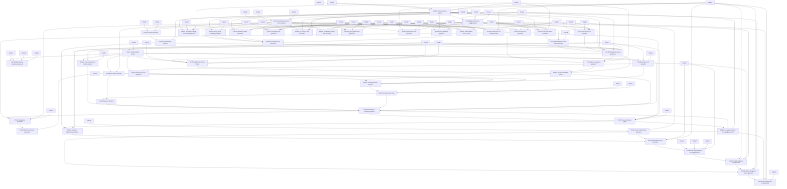

# Dependency Graph

```mermaid
graph TD
  PG033 --> PG125["PG125 frontend-profile-selector"]
  PG053 --> PG125["PG125 frontend-profile-selector"]
  PG055 --> PG125["PG125 frontend-profile-selector"]
  PG064 --> PG125["PG125 frontend-profile-selector"]
  PG115 --> PG126["PG126 typescript-client-sdk-generator"]
  PG116 --> PG126["PG126 typescript-client-sdk-generator"]
  PG124 --> PG126["PG126 typescript-client-sdk-generator"]
  PG125 --> PG126["PG126 typescript-client-sdk-generator"]
  PG041 --> PG127["PG127 auth-session-ui-generator"]
  PG050 --> PG127["PG127 auth-session-ui-generator"]
  PG096 --> PG127["PG127 auth-session-ui-generator"]
  PG108 --> PG127["PG127 auth-session-ui-generator"]
  PG125 --> PG127["PG127 auth-session-ui-generator"]
  PG034 --> PG128["PG128 form-validation-generator"]
  PG039 --> PG128["PG128 form-validation-generator"]
  PG125 --> PG128["PG128 form-validation-generator"]
  PG126 --> PG128["PG128 form-validation-generator"]
  PG033 --> PG129["PG129 crud-table-detail-generator"]
  PG040 --> PG129["PG129 crud-table-detail-generator"]
  PG041 --> PG129["PG129 crud-table-detail-generator"]
  PG125 --> PG129["PG129 crud-table-detail-generator"]
  PG126 --> PG129["PG129 crud-table-detail-generator"]
  PG027 --> PG130["PG130 dashboard-chart-generator"]
  PG040 --> PG130["PG130 dashboard-chart-generator"]
  PG125 --> PG130["PG130 dashboard-chart-generator"]
  PG126 --> PG130["PG130 dashboard-chart-generator"]
  PG033 --> PG131["PG131 navigation-routing-permission-generator"]
  PG041 --> PG131["PG131 navigation-routing-permission-generator"]
  PG045 --> PG131["PG131 navigation-routing-permission-generator"]
  PG125 --> PG131["PG131 navigation-routing-permission-generator"]
  PG063 --> PG132["PG132 design-token-component-adapter"]
  PG125 --> PG132["PG132 design-token-component-adapter"]
  PG048 --> PG133["PG133 frontend-state-data-fetch-generator"]
  PG126 --> PG133["PG133 frontend-state-data-fetch-generator"]
  PG129 --> PG133["PG133 frontend-state-data-fetch-generator"]
  PG076 --> PG134["PG134 fullstack-e2e-wiring-generator"]
  PG088 --> PG134["PG134 fullstack-e2e-wiring-generator"]
  PG100 --> PG134["PG134 fullstack-e2e-wiring-generator"]
  PG112 --> PG134["PG134 fullstack-e2e-wiring-generator"]
  PG124 --> PG134["PG134 fullstack-e2e-wiring-generator"]
  PG125 --> PG134["PG134 fullstack-e2e-wiring-generator"]
  PG126 --> PG134["PG134 fullstack-e2e-wiring-generator"]
  PG127 --> PG134["PG134 fullstack-e2e-wiring-generator"]
  PG133 --> PG134["PG134 fullstack-e2e-wiring-generator"]
  PG026 --> PG135["PG135 requirement-to-test-trace-compiler"]
  PG028 --> PG135["PG135 requirement-to-test-trace-compiler"]
  PG031 --> PG135["PG135 requirement-to-test-trace-compiler"]
  PG042 --> PG135["PG135 requirement-to-test-trace-compiler"]
  PG034 --> PG136["PG136 unit-test-generator"]
  PG035 --> PG136["PG136 unit-test-generator"]
  PG067 --> PG136["PG136 unit-test-generator"]
  PG135 --> PG136["PG136 unit-test-generator"]
  PG113 --> PG137["PG137 integration-test-generator"]
  PG117 --> PG137["PG137 integration-test-generator"]
  PG118 --> PG137["PG137 integration-test-generator"]
  PG119 --> PG137["PG137 integration-test-generator"]
  PG123 --> PG137["PG137 integration-test-generator"]
  PG135 --> PG137["PG137 integration-test-generator"]
  PG115 --> PG138["PG138 api-contract-test-generator"]
  PG116 --> PG138["PG138 api-contract-test-generator"]
  PG124 --> PG138["PG138 api-contract-test-generator"]
  PG126 --> PG138["PG138 api-contract-test-generator"]
  PG135 --> PG138["PG138 api-contract-test-generator"]
  PG113 --> PG139["PG139 database-migration-test-generator"]
  PG114 --> PG139["PG139 database-migration-test-generator"]
  PG135 --> PG139["PG139 database-migration-test-generator"]
  PG033 --> PG140["PG140 e2e-journey-test-generator"]
  PG134 --> PG140["PG140 e2e-journey-test-generator"]
  PG135 --> PG140["PG140 e2e-journey-test-generator"]
  PG034 --> PG141["PG141 property-based-test-generator"]
  PG038 --> PG141["PG141 property-based-test-generator"]
  PG039 --> PG141["PG141 property-based-test-generator"]
  PG135 --> PG141["PG141 property-based-test-generator"]
  PG026 --> PG142["PG142 mutation-test-planner"]
  PG136 --> PG142["PG142 mutation-test-planner"]
  PG027 --> PG143["PG143 performance-test-generator"]
  PG046 --> PG143["PG143 performance-test-generator"]
  PG053 --> PG143["PG143 performance-test-generator"]
  PG135 --> PG143["PG143 performance-test-generator"]
  PG041 --> PG144["PG144 security-test-generator"]
  PG050 --> PG144["PG144 security-test-generator"]
  PG135 --> PG144["PG144 security-test-generator"]
  PG128 --> PG145["PG145 accessibility-test-generator"]
  PG130 --> PG145["PG145 accessibility-test-generator"]
  PG132 --> PG145["PG145 accessibility-test-generator"]
  PG135 --> PG145["PG145 accessibility-test-generator"]
  PG034 --> PG146["PG146 test-data-and-fixture-factory"]
  PG039 --> PG146["PG146 test-data-and-fixture-factory"]
  PG113 --> PG146["PG146 test-data-and-fixture-factory"]
  PG135 --> PG146["PG146 test-data-and-fixture-factory"]
  PG009 --> PG147["PG147 isolated-build-runner"]
  PG076 --> PG147["PG147 isolated-build-runner"]
  PG058 --> PG148["PG148 dependency-resolution-diagnoser"]
  PG098 --> PG148["PG148 dependency-resolution-diagnoser"]
  PG110 --> PG148["PG148 dependency-resolution-diagnoser"]
  PG147 --> PG148["PG148 dependency-resolution-diagnoser"]
  PG069 --> PG149["PG149 compile-error-classifier"]
  PG076 --> PG149["PG149 compile-error-classifier"]
  PG147 --> PG149["PG149 compile-error-classifier"]
  PG135 --> PG150["PG150 test-failure-classifier"]
  PG147 --> PG150["PG150 test-failure-classifier"]
  PG052 --> PG151["PG151 runtime-log-trace-diagnoser"]
  PG147 --> PG151["PG151 runtime-log-trace-diagnoser"]
  PG088 --> PG152["PG152 application-startup-probe"]
  PG100 --> PG152["PG152 application-startup-probe"]
  PG112 --> PG152["PG152 application-startup-probe"]
  PG134 --> PG152["PG152 application-startup-probe"]
  PG147 --> PG152["PG152 application-startup-probe"]
  PG134 --> PG153["PG153 smoke-and-health-verifier"]
  PG140 --> PG153["PG153 smoke-and-health-verifier"]
  PG152 --> PG153["PG153 smoke-and-health-verifier"]
  PG071 --> PG154["PG154 automated-patch-planner"]
  PG149 --> PG154["PG154 automated-patch-planner"]
  PG150 --> PG154["PG154 automated-patch-planner"]
  PG151 --> PG154["PG154 automated-patch-planner"]
  PG153 --> PG154["PG154 automated-patch-planner"]
  PG073 --> PG155["PG155 bounded-repair-loop"]
  PG074 --> PG155["PG155 bounded-repair-loop"]
  PG154 --> PG155["PG155 bounded-repair-loop"]
  PG150 --> PG156["PG156 flaky-test-detector"]
  PG155 --> PG156["PG156 flaky-test-detector"]
  PG057 --> PG157["PG157 cross-environment-matrix-validator"]
  PG076 --> PG157["PG157 cross-environment-matrix-validator"]
  PG147 --> PG157["PG157 cross-environment-matrix-validator"]
  PG147 --> PG158["PG158 build-green-evidence-publisher"]
  PG153 --> PG158["PG158 build-green-evidence-publisher"]
  PG155 --> PG158["PG158 build-green-evidence-publisher"]
  PG156 --> PG158["PG158 build-green-evidence-publisher"]
  PG157 --> PG158["PG158 build-green-evidence-publisher"]
  PG061 --> PG159["PG159 ci-pipeline-generator"]
  PG135 --> PG159["PG159 ci-pipeline-generator"]
  PG144 --> PG159["PG159 ci-pipeline-generator"]
  PG158 --> PG159["PG159 ci-pipeline-generator"]
  PG071 --> PG160["PG160 branch-pr-checks-generator"]
  PG159 --> PG160["PG160 branch-pr-checks-generator"]
  PG050 --> PG161["PG161 secret-config-policy-generator"]
  PG062 --> PG161["PG161 secret-config-policy-generator"]
  PG066 --> PG162["PG162 sast-sca-license-gate"]
  PG076 --> PG162["PG162 sast-sca-license-gate"]
  PG144 --> PG162["PG162 sast-sca-license-gate"]
  PG158 --> PG162["PG162 sast-sca-license-gate"]
  PG088 --> PG163["PG163 container-hardening-generator"]
  PG100 --> PG163["PG163 container-hardening-generator"]
  PG112 --> PG163["PG163 container-hardening-generator"]
  PG162 --> PG163["PG163 container-hardening-generator"]
  PG053 --> PG164["PG164 kubernetes-helm-generator"]
  PG052 --> PG164["PG164 kubernetes-helm-generator"]
  PG161 --> PG164["PG164 kubernetes-helm-generator"]
  PG163 --> PG164["PG164 kubernetes-helm-generator"]
  PG050 --> PG165["PG165 infrastructure-as-code-generator"]
  PG053 --> PG165["PG165 infrastructure-as-code-generator"]
  PG117 --> PG165["PG165 infrastructure-as-code-generator"]
  PG119 --> PG165["PG165 infrastructure-as-code-generator"]
  PG052 --> PG166["PG166 otel-logging-metrics-tracing-generator"]
  PG085 --> PG166["PG166 otel-logging-metrics-tracing-generator"]
  PG097 --> PG166["PG166 otel-logging-metrics-tracing-generator"]
  PG109 --> PG166["PG166 otel-logging-metrics-tracing-generator"]
  PG164 --> PG166["PG166 otel-logging-metrics-tracing-generator"]
  PG027 --> PG167["PG167 health-readiness-slo-generator"]
  PG052 --> PG167["PG167 health-readiness-slo-generator"]
  PG053 --> PG167["PG167 health-readiness-slo-generator"]
  PG166 --> PG167["PG167 health-readiness-slo-generator"]
  PG124 --> PG168["PG168 release-versioning-changelog-generator"]
  PG158 --> PG168["PG168 release-versioning-changelog-generator"]
  PG162 --> PG168["PG168 release-versioning-changelog-generator"]
  PG026 --> PG169["PG169 canary-bluegreen-rollout-generator"]
  PG053 --> PG169["PG169 canary-bluegreen-rollout-generator"]
  PG167 --> PG169["PG169 canary-bluegreen-rollout-generator"]
  PG168 --> PG169["PG169 canary-bluegreen-rollout-generator"]
  PG049 --> PG170["PG170 rollback-disaster-recovery-plan"]
  PG053 --> PG170["PG170 rollback-disaster-recovery-plan"]
  PG114 --> PG170["PG170 rollback-disaster-recovery-plan"]
  PG168 --> PG170["PG170 rollback-disaster-recovery-plan"]
  PG169 --> PG170["PG170 rollback-disaster-recovery-plan"]
```
