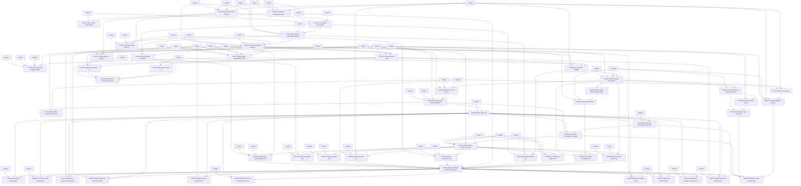

# Dependency Graph

```mermaid
graph TD
  PG032 --> PG171["PG171 spec-to-code-drift-detector"]
  PG042 --> PG171["PG171 spec-to-code-drift-detector"]
  PG064 --> PG171["PG171 spec-to-code-drift-detector"]
  PG076 --> PG171["PG171 spec-to-code-drift-detector"]
  PG158 --> PG171["PG171 spec-to-code-drift-detector"]
  PG071 --> PG172["PG172 code-to-spec-reconciliation"]
  PG171 --> PG172["PG172 code-to-spec-reconciliation"]
  PG071 --> PG173["PG173 manual-edit-preservation"]
  PG072 --> PG173["PG173 manual-edit-preservation"]
  PG074 --> PG173["PG173 manual-edit-preservation"]
  PG171 --> PG173["PG173 manual-edit-preservation"]
  PG032 --> PG174["PG174 incremental-regeneration-planner"]
  PG042 --> PG174["PG174 incremental-regeneration-planner"]
  PG073 --> PG174["PG174 incremental-regeneration-planner"]
  PG173 --> PG174["PG174 incremental-regeneration-planner"]
  PG032 --> PG175["PG175 change-set-impact-analyzer"]
  PG046 --> PG175["PG175 change-set-impact-analyzer"]
  PG050 --> PG175["PG175 change-set-impact-analyzer"]
  PG053 --> PG175["PG175 change-set-impact-analyzer"]
  PG174 --> PG175["PG175 change-set-impact-analyzer"]
  PG045 --> PG176["PG176 architecture-drift-detector"]
  PG047 --> PG176["PG176 architecture-drift-detector"]
  PG050 --> PG176["PG176 architecture-drift-detector"]
  PG053 --> PG176["PG176 architecture-drift-detector"]
  PG171 --> PG176["PG176 architecture-drift-detector"]
  PG114 --> PG177["PG177 database-api-compatibility-check"]
  PG115 --> PG177["PG177 database-api-compatibility-check"]
  PG116 --> PG177["PG177 database-api-compatibility-check"]
  PG117 --> PG177["PG177 database-api-compatibility-check"]
  PG124 --> PG177["PG177 database-api-compatibility-check"]
  PG175 --> PG177["PG177 database-api-compatibility-check"]
  PG010 --> PG178["PG178 refactoring-and-upgrade-bridge"]
  PG057 --> PG178["PG178 refactoring-and-upgrade-bridge"]
  PG058 --> PG178["PG178 refactoring-and-upgrade-bridge"]
  PG175 --> PG178["PG178 refactoring-and-upgrade-bridge"]
  PG177 --> PG178["PG178 refactoring-and-upgrade-bridge"]
  PG007 --> PG179["PG179 human-approval-gate"]
  PG008 --> PG179["PG179 human-approval-gate"]
  PG031 --> PG179["PG179 human-approval-gate"]
  PG175 --> PG179["PG179 human-approval-gate"]
  PG158 --> PG180["PG180 git-pr-delivery-manager"]
  PG175 --> PG180["PG180 git-pr-delivery-manager"]
  PG177 --> PG180["PG180 git-pr-delivery-manager"]
  PG179 --> PG180["PG180 git-pr-delivery-manager"]
  PG005 --> PG181["PG181 synthesis-agent-orchestrator"]
  PG008 --> PG181["PG181 synthesis-agent-orchestrator"]
  PG009 --> PG181["PG181 synthesis-agent-orchestrator"]
  PG180 --> PG181["PG181 synthesis-agent-orchestrator"]
  PG181 --> PG182["PG182 planner-coder-reviewer-agent-team"]
  PG008 --> PG183["PG183 skill-discovery-and-routing"]
  PG062 --> PG183["PG183 skill-discovery-and-routing"]
  PG181 --> PG183["PG183 skill-discovery-and-routing"]
  PG002 --> PG184["PG184 skill-input-output-contract-validator"]
  PG003 --> PG184["PG184 skill-input-output-contract-validator"]
  PG007 --> PG184["PG184 skill-input-output-contract-validator"]
  PG183 --> PG184["PG184 skill-input-output-contract-validator"]
  PG008 --> PG185["PG185 skill-sandbox-permission-enforcer"]
  PG147 --> PG185["PG185 skill-sandbox-permission-enforcer"]
  PG184 --> PG185["PG185 skill-sandbox-permission-enforcer"]
  PG009 --> PG186["PG186 model-routing-and-budget-controller"]
  PG181 --> PG186["PG186 model-routing-and-budget-controller"]
  PG004 --> PG187["PG187 context-pack-builder"]
  PG009 --> PG187["PG187 context-pack-builder"]
  PG182 --> PG187["PG187 context-pack-builder"]
  PG065 --> PG188["PG188 domain-pack-sdk"]
  PG184 --> PG188["PG188 domain-pack-sdk"]
  PG066 --> PG189["PG189 template-skill-marketplace-publisher"]
  PG188 --> PG189["PG189 template-skill-marketplace-publisher"]
  PG184 --> PG190["PG190 skill-version-compatibility-manager"]
  PG188 --> PG190["PG190 skill-version-compatibility-manager"]
  PG189 --> PG190["PG190 skill-version-compatibility-manager"]
  PG077 --> PG191["PG191 golden-project-benchmark-suite"]
  PG089 --> PG191["PG191 golden-project-benchmark-suite"]
  PG101 --> PG191["PG191 golden-project-benchmark-suite"]
  PG124 --> PG191["PG191 golden-project-benchmark-suite"]
  PG190 --> PG191["PG191 golden-project-benchmark-suite"]
  PG011 --> PG192["PG192 requirements-understanding-eval"]
  PG020 --> PG192["PG192 requirements-understanding-eval"]
  PG021 --> PG192["PG192 requirements-understanding-eval"]
  PG031 --> PG192["PG192 requirements-understanding-eval"]
  PG191 --> PG192["PG192 requirements-understanding-eval"]
  PG043 --> PG193["PG193 architecture-quality-eval"]
  PG054 --> PG193["PG193 architecture-quality-eval"]
  PG191 --> PG193["PG193 architecture-quality-eval"]
  PG069 --> PG194["PG194 code-correctness-eval"]
  PG075 --> PG194["PG194 code-correctness-eval"]
  PG191 --> PG194["PG194 code-correctness-eval"]
  PG147 --> PG195["PG195 build-run-success-eval"]
  PG156 --> PG195["PG195 build-run-success-eval"]
  PG158 --> PG195["PG195 build-run-success-eval"]
  PG191 --> PG195["PG195 build-run-success-eval"]
  PG050 --> PG196["PG196 security-compliance-eval"]
  PG145 --> PG196["PG196 security-compliance-eval"]
  PG162 --> PG196["PG196 security-compliance-eval"]
  PG191 --> PG196["PG196 security-compliance-eval"]
  PG042 --> PG197["PG197 traceability-completeness-eval"]
  PG076 --> PG197["PG197 traceability-completeness-eval"]
  PG158 --> PG197["PG197 traceability-completeness-eval"]
  PG169 --> PG197["PG197 traceability-completeness-eval"]
  PG173 --> PG198["PG198 regeneration-safety-eval"]
  PG174 --> PG198["PG198 regeneration-safety-eval"]
  PG180 --> PG198["PG198 regeneration-safety-eval"]
  PG191 --> PG198["PG198 regeneration-safety-eval"]
  PG077 --> PG199["PG199 cross-language-parity-eval"]
  PG089 --> PG199["PG199 cross-language-parity-eval"]
  PG101 --> PG199["PG199 cross-language-parity-eval"]
  PG191 --> PG199["PG199 cross-language-parity-eval"]
  PG181 --> PG200["PG200 large-project-scalability-eval"]
  PG187 --> PG200["PG200 large-project-scalability-eval"]
  PG191 --> PG200["PG200 large-project-scalability-eval"]
  PG149 --> PG201["PG201 failure-recovery-chaos-eval"]
  PG150 --> PG201["PG201 failure-recovery-chaos-eval"]
  PG181 --> PG201["PG201 failure-recovery-chaos-eval"]
  PG191 --> PG201["PG201 failure-recovery-chaos-eval"]
  PG192 --> PG202["PG202 project-synthesis-product-certification"]
  PG193 --> PG202["PG202 project-synthesis-product-certification"]
  PG194 --> PG202["PG202 project-synthesis-product-certification"]
  PG195 --> PG202["PG202 project-synthesis-product-certification"]
  PG196 --> PG202["PG202 project-synthesis-product-certification"]
  PG197 --> PG202["PG202 project-synthesis-product-certification"]
  PG198 --> PG202["PG202 project-synthesis-product-certification"]
  PG199 --> PG202["PG202 project-synthesis-product-certification"]
  PG200 --> PG202["PG202 project-synthesis-product-certification"]
  PG201 --> PG202["PG202 project-synthesis-product-certification"]
  PG051 --> PG203["PG203 saas-admin-domain-pack"]
  PG188 --> PG203["PG203 saas-admin-domain-pack"]
  PG202 --> PG203["PG203 saas-admin-domain-pack"]
  PG122 --> PG204["PG204 ecommerce-order-domain-pack"]
  PG188 --> PG204["PG204 ecommerce-order-domain-pack"]
  PG202 --> PG204["PG204 ecommerce-order-domain-pack"]
  PG117 --> PG205["PG205 warehouse-logistics-domain-pack"]
  PG188 --> PG205["PG205 warehouse-logistics-domain-pack"]
  PG202 --> PG205["PG205 warehouse-logistics-domain-pack"]
  PG117 --> PG206["PG206 manufacturing-mes-iot-domain-pack"]
  PG188 --> PG206["PG206 manufacturing-mes-iot-domain-pack"]
  PG202 --> PG206["PG206 manufacturing-mes-iot-domain-pack"]
  PG117 --> PG207["PG207 energy-ems-vpp-domain-pack"]
  PG188 --> PG207["PG207 energy-ems-vpp-domain-pack"]
  PG202 --> PG207["PG207 energy-ems-vpp-domain-pack"]
  PG119 --> PG208["PG208 healthcare-clinical-admin-domain-pack"]
  PG188 --> PG208["PG208 healthcare-clinical-admin-domain-pack"]
  PG202 --> PG208["PG208 healthcare-clinical-admin-domain-pack"]
  PG117 --> PG209["PG209 digital-twin-domain-pack"]
  PG188 --> PG209["PG209 digital-twin-domain-pack"]
  PG202 --> PG209["PG209 digital-twin-domain-pack"]
  PG092 --> PG210["PG210 ai-agent-rag-domain-pack"]
  PG188 --> PG210["PG210 ai-agent-rag-domain-pack"]
  PG202 --> PG210["PG210 ai-agent-rag-domain-pack"]
  PG039 --> PG211["PG211 data-platform-analytics-domain-pack"]
  PG188 --> PG211["PG211 data-platform-analytics-domain-pack"]
  PG202 --> PG211["PG211 data-platform-analytics-domain-pack"]
  PG038 --> PG212["PG212 workflow-approval-domain-pack"]
  PG179 --> PG212["PG212 workflow-approval-domain-pack"]
  PG188 --> PG212["PG212 workflow-approval-domain-pack"]
  PG202 --> PG212["PG212 workflow-approval-domain-pack"]
  PG011 --> PG213["PG213 requirement-studio-ui"]
  PG031 --> PG213["PG213 requirement-studio-ui"]
  PG179 --> PG213["PG213 requirement-studio-ui"]
  PG054 --> PG214["PG214 architecture-review-ui"]
  PG179 --> PG214["PG214 architecture-review-ui"]
  PG173 --> PG215["PG215 project-preview-and-diff-ui"]
  PG174 --> PG215["PG215 project-preview-and-diff-ui"]
  PG175 --> PG215["PG215 project-preview-and-diff-ui"]
  PG147 --> PG216["PG216 build-run-console-ui"]
  PG158 --> PG216["PG216 build-run-console-ui"]
  PG181 --> PG216["PG216 build-run-console-ui"]
  PG004 --> PG217["PG217 artifact-evidence-explorer"]
  PG007 --> PG217["PG217 artifact-evidence-explorer"]
  PG197 --> PG217["PG217 artifact-evidence-explorer"]
  PG179 --> PG218["PG218 collaborative-comment-approval"]
  PG213 --> PG218["PG218 collaborative-comment-approval"]
  PG214 --> PG218["PG218 collaborative-comment-approval"]
  PG215 --> PG218["PG218 collaborative-comment-approval"]
  PG008 --> PG219["PG219 tenant-policy-and-quota"]
  PG186 --> PG219["PG219 tenant-policy-and-quota"]
  PG186 --> PG220["PG220 generation-usage-metering"]
  PG219 --> PG220["PG220 generation-usage-metering"]
  PG007 --> PG221["PG221 support-diagnostic-bundle"]
  PG009 --> PG221["PG221 support-diagnostic-bundle"]
  PG158 --> PG221["PG221 support-diagnostic-bundle"]
  PG216 --> PG221["PG221 support-diagnostic-bundle"]
  PG189 --> PG222["PG222 feedback-to-skill-learning-loop"]
  PG190 --> PG222["PG222 feedback-to-skill-learning-loop"]
  PG202 --> PG222["PG222 feedback-to-skill-learning-loop"]
  PG220 --> PG222["PG222 feedback-to-skill-learning-loop"]
  PG221 --> PG222["PG222 feedback-to-skill-learning-loop"]
```
