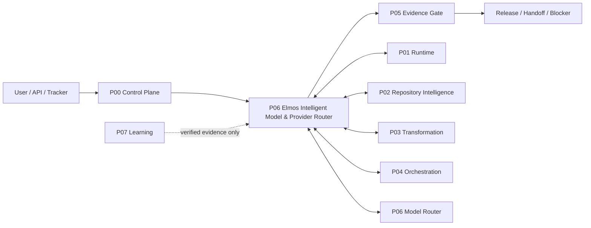
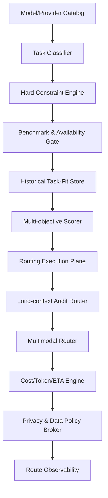

# P06 架构设计：Elmos 智能模型、Provider 与成本路由

## 1. 架构原则

- 结果优先：项目生成与跨库转换的准确度、完整度、行为等价性和可证明性高于 Harness 炫技。
- Elmos Core 不绑定任何单一 Harness、模型或模型聚合商；所有外部能力经稳定 SPI/Adapter 接入。
- Agent 的“完成”声明不具有裁决权；只有机械化 Evidence Gate 可以把任务置为 COMPLETED。
- 所有模型可见事实、工具调用、审批、安全决策和验证证据必须可审计、可回放或明确标记为瞬态。
- 未知语义缺口比已知缺口更危险；系统必须显式计算发现覆盖率并持续压低 unknown gap。
- 规则优先、约束生成、模型兜底；经过验证的确定性转换应逐步替代重复的自由推理。
- 权限、沙箱、凭据、租户数据与生产副作用均 fail closed；禁止静默降级为更宽权限或无沙箱执行。
- 每次失败必须产生可复用的诊断、修复与回归证据，但未经跨项目验证不得晋升为可信规则。
- 仓库是系统记录：架构、计划、能力、验证、决策、数据契约和运行手册都在版本控制中可被 Agent 读取。
- 商业指标必须分场景、分规模、分难度报告；不得把内部目标值伪装成已实测的统一准确率。

## 2. 上下文边界

## 3. 内部组件

| 组件 | 职责 |
| --- | --- |
| Model/Provider Catalog | 模型、版本、能力、价格、上下文、模态、参数和 Provider endpoints。 |
| Task Classifier | 角色、语言、框架、复杂度、规模、风险、时效、隐私与所需输出。 |
| Hard Constraint Engine | ZDR、数据收集、地区、BYOK、max price、latency/throughput、参数。 |
| Benchmark & Availability Gate | 外部榜单、模型 ID 解析、Provider 健康和实际可路由检查。 |
| Historical Task-Fit Store | Elmos 真实任务质量、成本、修复、失败与置信区间。 |
| Multi-objective Scorer | quality/completeness/reliability/cost/latency/cache/privacy risk。 |
| Routing Execution Plane | order/fallback/circuit breaker/hedging/shadow/canary/escalation。 |
| Long-context Audit Router | 把 Repository Graph/IR/Ledger/target/tests 送给大上下文审计角色。 |
| Multimodal Router | 按 image/video/DOM/UI verification 能力选择模型。 |
| Cost/Token/ETA Engine | 多轮总用量、缓存、价格、工具时间和机器 ETA。 |
| Privacy & Data Policy Broker | 数据分类、redaction、provider policy、tenant opt-in/out。 |
| Route Observability | 选择证据、健康、成本、质量反馈、fallback 和 drift。 |

## 4. 分层与依赖规则

1. **Contract Layer**：Schema、API/SPI、事件词汇、错误码；只向后兼容或显式升版。
2. **Domain Layer**：本包业务状态与不变量；不依赖外部 Harness SDK 类型。
3. **Application Layer**：工作流、用例、策略与 Gate；调用 Domain 与 Port。
4. **Adapter Layer**：DeepSeek/OpenCode/OpenHarness/OpenRouter/GitHub/DB 等实现。
5. **Infrastructure Layer**：存储、队列、缓存、沙箱、可观测；可替换。

禁止 Adapter 反向定义 Domain 真相，禁止 UI/CLI 直接修改持久状态，禁止跨包读取私有表。

## 5. 一致性与持久化

- 关键状态以 immutable revision 或 append-only event 表达；派生视图可重建。
- 所有副作用绑定 idempotency key、attempt、source revision 和 actor。
- 状态机更新采用 compare-and-set/事务；跨服务使用 outbox/inbox 与幂等消费者。
- 大型 artifact 内容寻址存储，领域记录只保存 hash、URI、媒体类型、保留策略和 ACL。
- 动态配置以 versioned snapshot 进入 run；运行中不隐式读取变化的 global config。

## 6. 扩展策略

- 新 Harness：实现 P01 Adapter Conformance。
- 新模型/Provider：实现 P06 Catalog/Invoke/Usage/Health 合同。
- 新语言/框架：实现 P02 Language Pack + P03 Rule/Emitter/Adapter + P05 Benchmark。
- 新项目类型：实现 P03 Archetype + P05 acceptance baseline + P07 knowledge scope。
- 新 Tracker：实现 P04 Adapter，并确保 host-side credential boundary。

## 7. 部署拓扑

| 服务 | 建议形态 | 可扩展方式 |
| --- | --- | --- |
| Control/API | 无状态服务 + 多可用区 | 水平扩展，读写分离。 |
| Scheduler/Orchestrator | 分片 leader + durable queue | 按 tenant/project shard；lease 防双调度。 |
| Runtime Worker | 容器/微 VM/远程 runner | 按语言、工具、风险和硬件池扩展。 |
| Graph/Metadata Store | Postgres + 图查询/索引层 | snapshot 分区、冷热分层。 |
| Artifact/Evidence Store | 对象存储 + WORM/签名选项 | 内容寻址、生命周期管理。 |
| Observability | OTel logs/metrics/traces | tenant-aware、per-worktree/run 查询。 |

## 8. 技术决策记录（必须建立 ADR）

- ADR-001：外部 Harness 仅经 Adapter 接入。
- ADR-002：Session/证据/台账使用不可变 revision 与追加事件。
- ADR-003：完成裁决只属于 P05。
- ADR-004：模型路由硬隐私约束先于多目标评分。
- ADR-005：validated deterministic rule 优先于自由模型生成。
