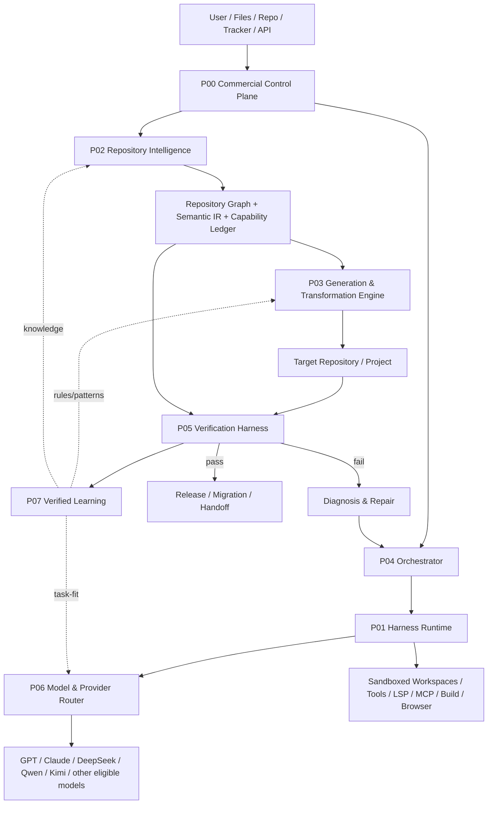
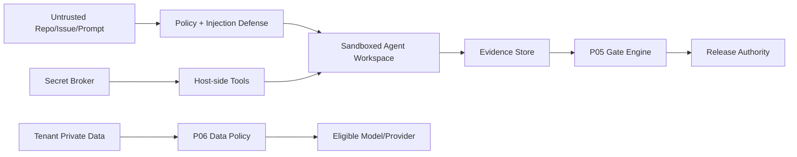

# Elmos 7+1 商业参考架构

## 1. 产品定义

`Elmos = Repository Intelligence + Transformation Science + Verification OS + Harness Runtime + Software Factory Control Plane + Learning Flywheel`

模型、Provider、Harness、UI 和执行环境可替换；Repository Graph、Semantic IR、Capability Ledger、Transformation Rules、Differential Runtime 和 Evidence Corpus 是 Elmos 自有核心。

## 2. 逻辑架构

## 3. 三个平面

### Control Plane

Tenant、Project、Job、Workflow、Policy、Quota、Cost、ETA、Billing、SLA、Feature Flags、Release 和 Audit。

### Execution Plane

Scheduler、Run/Session、Agent、Tool、Task、Workspace、Sandbox、LSP/MCP、Model Gateway、Build/Test/Browser 和 Artifact。

### Evidence & Knowledge Plane

Repository Graph、Semantic IR、Requirement/Capability Ledger、Test/Differential Evidence、Rule/Repair/Benchmark/Knowledge 和 Certification。

控制面不能直接改 Evidence 真相；执行面不能直接发布；知识面只接受受信证据。

## 4. 信任边界

- 外部文本和代码始终不可信。
- 长期凭据不进入 Agent 环境。
- 模型输出不可信，必须通过结构/行为/安全验证。
- Evidence Store 与 Gate Engine 对 Agent 只读/append，不允许篡改历史结果。

## 5. 关键状态机

### Job

`created → planning → ready → running → verifying → repairing → review → releasing → completed`

异常：`blocked / cancelled / failed / rolled_back`。

### Capability

`discovered → mapped → generated → compiled → tested → verified`

分支：`blocked / unsupported / semantic_gap`。不得从 discovered 直接 verified。

### Session/Turn

`idle → open → model_streaming → tool_pending/running → committed → idle`

崩溃后：已提交事实保留，open turn 闭合为 interrupted。

### Rule

`experimental → candidate → validated → trusted → certified → deprecated`

任意阶段可因证据撤销、漂移或回归进入 quarantined/demoted。

## 6. 端到端转换序列

1. P00 创建 Job，冻结 workflow/policy/source/budget。
2. P01 readiness 检查 Adapter、模型、工具、沙箱、权限、磁盘和配额。
3. P02 扫描源仓库，发布 inventory/graph/IR/capability snapshot。
4. P03 建目标架构、规则计划、Target IR、代码/迁移/部署 artifacts。
5. P04 把任务分配到隔离 worktree，专业 Agent 通过 P01/P06 执行。
6. P05 编译、合同、差分、E2E、非功能验证；失败生成最小 Repair Task。
7. P04/P01 执行 Repair，P05 重跑定向测试和影响闭包。
8. Gate pass 后，P00/P04 执行 Human Review、PR/Release、shadow/cutover/rollback。
9. P07 只吸收 verified + authorized 的规则、修复、模式和 route outcome。

## 7. 数据存储建议

| 数据 | 主存储 | 说明 |
| --- | --- | --- |
| Tenant/Project/Job/Policy | Postgres | 强一致、审计、版本化。 |
| Session/Event/Run Journal | Append log + Postgres/SQLite shard | 可回放、按 run 分区。 |
| Repository Graph/IR | Postgres + graph/index layer | snapshot、provenance、增量 shard。 |
| Code/Trace/Media/Evidence | Object store | 内容寻址、WORM/签名/retention。 |
| Queue/Leases | Durable queue + DB leases | 防双调度、可恢复。 |
| Metrics/Logs/Traces | OTel backend | tenant/run/worktree 维度。 |
| KB/Repair/Benchmark | Postgres/vector/index + artifact store | scope、consent、evidence lineage。 |

## 8. 生产部署建议

- 控制面：Java/Rust/Go 任选成熟栈；P00/P04 强一致状态优先。
- Agent 与算法：Python/TypeScript 可快速实现；高风险网关/策略/沙箱建议 Rust。
- Worker pools 按语言、OS、工具、风险和硬件隔离。
- 机密客户可采用私有部署或客户 VPC Worker，控制面只保存必要元数据。
- Adapter 进程隔离，单个上游 SDK 崩溃不影响核心控制面。

## 9. 商业护城河

1. verified repository/capability graph corpus。
2. Semantic IR 与跨语言/框架 rule graph。
3. Differential scenarios 与 evidence corpus。
4. Failure→repair traces 与规则晋升数据。
5. 按任务、语言、框架和规模的 verified model task-fit。
6. 企业迁移、切流、回滚和认证运行经验。
