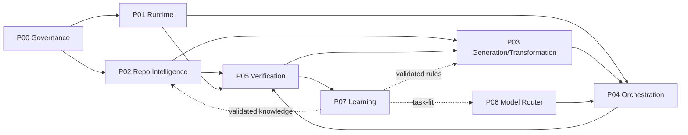

# Elmos 7+1 Phase Map

## 总原则

- Phase 是能力成熟度门，不是纯时间排期。
- 可并行开发，但不能越过依赖 Gate。
- 优先构建一个真实 vertical slice，再扩语言/框架/行业矩阵。
- 研发计划同时报告系统机器执行 ETA 与人工实施工作量，两者不能混淆。

## Phase 0 — 基线、合同与商业治理

**涉及包：** P00 Elmos 软件工厂总控与商业治理

**目标：** 冻结源版本、定义跨包合同、建立仓库记录、Benchmark 基线、风险与发布规则。

**退出门：** Package Registry、共享 Schema、ELMOS_WORKFLOW、基准仓库、质量指标和安全边界全部通过评审。

**必须交付：**

- 版本化合同、Schema、状态机与错误码。
- 最小端到端 vertical slice 和可重放证据。
- 安全/数据/权限/沙箱/租户边界测试。
- 指标、SLO、Dashboard、Runbook、迁移和回滚。
- 影响闭包 Benchmark 与 P05 GateDecision。
## Phase 1 — 可信理解、执行与验证底座

**涉及包：** P02 Elmos 仓库智能与语义中间表示, P05 Elmos 转换可靠性、验证与证据完成门, P01 Elmos 可插拔 Harness 运行时平台

**目标：** 先确保知道“有什么、漏了什么、怎么证明”，再把 Harness 作为可靠执行底座接入。

**退出门：** 至少一个端到端源仓库扫描→IR→Capability Ledger→生成样例→Evidence Gate 的闭环可重放。

**必须交付：**

- 版本化合同、Schema、状态机与错误码。
- 最小端到端 vertical slice 和可重放证据。
- 安全/数据/权限/沙箱/租户边界测试。
- 指标、SLO、Dashboard、Runbook、迁移和回滚。
- 影响闭包 Benchmark 与 P05 GateDecision。
## Phase 2 — 商业项目生成与跨库软件工厂

**涉及包：** P03 Elmos 完整项目生成与多语言跨库转换引擎, P04 Elmos 多 Agent 编排与自主软件工厂, P06 Elmos 智能模型、Provider 与成本路由

**目标：** 形成可销售的项目生成、跨语言/框架/数据库转换、多 Agent 自主执行和模型路由能力。

**退出门：** 核心场景达到内部 beta Gate：完整交付、可回滚、可计量、可解释、可审查。

**必须交付：**

- 版本化合同、Schema、状态机与错误码。
- 最小端到端 vertical slice 和可重放证据。
- 安全/数据/权限/沙箱/租户边界测试。
- 指标、SLO、Dashboard、Runbook、迁移和回滚。
- 影响闭包 Benchmark 与 P05 GateDecision。
## Phase 3 — 学习飞轮与内部复利

**涉及包：** P07 Elmos 转换知识沉淀、自学习与能力进化

**目标：** 把经过验证的规则、失败、修复、项目模式和证据转化为 Elmos 自有资产。

**退出门：** 规则晋升、跨项目回归、租户/IP 隔离和专项模型 shadow 流程可运行。

**必须交付：**

- 版本化合同、Schema、状态机与错误码。
- 最小端到端 vertical slice 和可重放证据。
- 安全/数据/权限/沙箱/租户边界测试。
- 指标、SLO、Dashboard、Runbook、迁移和回滚。
- 影响闭包 Benchmark 与 P05 GateDecision。
## Phase 4 — 企业 GA、规模化与 E1–E5 认证

**涉及包：** P00 Elmos 软件工厂总控与商业治理, P01 Elmos 可插拔 Harness 运行时平台, P02 Elmos 仓库智能与语义中间表示, P03 Elmos 完整项目生成与多语言跨库转换引擎, P04 Elmos 多 Agent 编排与自主软件工厂, P05 Elmos 转换可靠性、验证与证据完成门, P06 Elmos 智能模型、Provider 与成本路由, P07 Elmos 转换知识沉淀、自学习与能力进化

**目标：** 完成多租户、安全、SLA、计费、灾备、合规、升级、回滚和商业支持体系。

**退出门：** 指定场景取得 E4/E5 证据，完成 canary/rollback 演练和客户试点验收。

**必须交付：**

- 版本化合同、Schema、状态机与错误码。
- 最小端到端 vertical slice 和可重放证据。
- 安全/数据/权限/沙箱/租户边界测试。
- 指标、SLO、Dashboard、Runbook、迁移和回滚。
- 影响闭包 Benchmark 与 P05 GateDecision。

## 关键路径

## 不建议的顺序

- 先铺几十种语言 Adapter，但没有 Capability Ledger 与差分验证。
- 先做漂亮 Web IDE，却没有可恢复 Session 和机械化完成门。
- 先训练 Elmos 大模型，却没有高质量 verified corpus。
- 先自动发布/合并，却没有权限、沙箱、回滚与证据链。
