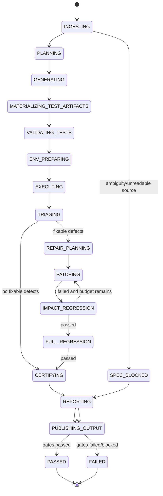

# 参考架构

## 1. 总体分层

Elmos 自主 QA 子系统由控制面、规格与追踪面、测试生成面、执行面、修复面、证据面和**项目产出面**组成。项目产出面负责把测试源文件和全部 QA 资产从临时运行状态转化为可下载、可版本化、可重放的正式交付物。

## 2. 核心组件

### 2.1 QA Control Plane

创建、暂停、恢复、取消测试任务；管理预算、优先级、租户、权限、审批、质量门禁、项目产出和发布认证。所有命令和外部副作用必须具有幂等键。

### 2.2 Project Context Ingestion

输入需求、约束、用户故事、法规、Git 仓库、现有测试、API Schema、DDL、消息 Schema、UI 设计、部署清单、SLO 和安全策略，输出不可变 `ProjectSnapshot`。

### 2.3 Requirement & Traceability Graph

节点包括 `REQ`、`CONSTRAINT`、`UXR`、`NFR`、`AC`、`FEATURE`、`API`、`UI`、`DATA`、`EVENT`、`CODE`、`TEST`、`TEST_FILE`、`DEFECT`、`PATCH`、`EVIDENCE`、`OUTPUT_BUNDLE`。

关键边：

- `implements`：代码/功能实现需求；
- `verifies`：测试验证需求；
- `materialized_as`：测试用例物化为测试文件或配置；
- `contains`：项目产出或 Bundle 包含文件；
- `observed_by`：测试结果由证据观测；
- `fixed_by`：缺陷被补丁修复；
- `derived_from`：产出源于快照、DSL、工具或旧版本；
- `supersedes`：新文件/产出替代旧版本。

Required 需求缺少 `verifies`，或 Required 测试缺少 `materialized_as`，均导致门禁失败。

### 2.4 Test Intelligence Planner

基于业务风险、代码变更、调用图、数据敏感度、历史缺陷、复杂度、并发性、外部依赖、可逆性和用户影响，生成测试策略、优先级、组合覆盖、并行策略、环境需求与产出计划。

### 2.5 Unified Test DSL & Generation Engine

统一 DSL 描述前置条件、步骤、Oracle、数据、环境、清理、证据和稳定性。语言/框架生成器输出实际测试源代码，不得只生成自然语言用例。

### 2.6 Test Artifact Materializer

将 Test DSL 转换为目标生态原生文件：

1. 探测语言、框架、构建系统和现有约定；
2. 规划安全相对路径和测试 Target；
3. 生成源文件、Fixture、Mock、数据、配置、基线和运行脚本；
4. 原子写入隔离 Worktree 或 Sidecar 项目副本；
5. 格式化、语法检查、测试发现、构建和冒烟执行；
6. 生成文件级哈希、需求映射和谱系；
7. 标记不再适用的旧测试为 `stale/superseded`，不静默删除。

### 2.7 Execution Mesh

按语言、UI、性能、安全和混沌测试隔离 Worker Pool；支持分片、并行、资源配额、环境租约、背压、取消、故障重放和内容寻址缓存。

### 2.8 Oracle & Evidence Engine

同时验证返回值、持久化数据、消息副作用、权限边界、审计日志、幂等、事务一致性、延迟、吞吐、资源、UI 语义、视觉、可访问性与业务不变量。证据包括日志、Trace、Metric、截图、视频、HAR、数据库快照、消息记录、Profile、覆盖率、补丁 Diff、测试文件哈希和构建记录。

### 2.9 Defect Intelligence & Safe Repair

将失败按根因聚类，生成最小复现、影响面和修复候选。修复在临时 Worktree/沙箱中完成，按风险分级进入自动接受或审批。修复产品代码或测试文件后，都必须更新 Manifest 与谱系并重新验证。

### 2.10 Reporting & Certification

输出管理摘要、工程报告、追踪矩阵、测试结果、缺陷、补丁、性能/UI/安全证据、机器 wall-clock ETA、实际耗时、人工等效时间和发布结论。

### 2.11 Project Output Registry & Publisher

负责：

- 创建 `ProjectOutput`、`OutputArtifact`、`OutputBundle` 和 `ArtifactLineage`；
- 将完整项目、tests-only 和 QA 证据打包；
- 生成 SHA-256、签名、不可变对象存储键和下载引用；
- 原子发布，避免用户下载到半成品；
- 即使运行失败，也发布状态明确的 partial/failed 产出；
- 对版本差异、过期测试、保留、legal hold 和垃圾回收进行治理。

## 3. 端到端状态机

`PUBLISHING_OUTPUT` 是终态前的强制步骤；除 `plan-only` 外，不允许没有可下载项目产出的 `PASSED`。

## 4. 项目产出数据模型

- `ProjectOutput`：一次运行针对某项目修订发布的不可变交付集合。
- `OutputArtifact`：单个源文件、配置、数据、报告、证据、补丁或证书。
- `TestArtifactSet`：所有测试相关文件的逻辑集合，记录原生目录、工具链和入口命令。
- `OutputBundle`：完整项目、tests-only、QA 证据或补丁压缩包。
- `ArtifactLineage`：`generated_from`、`modified_by`、`supersedes`、`validated_by` 等谱系事件。

元数据存 PostgreSQL；大文件和 Bundle 存对象存储；内容哈希用于去重与完整性校验。

## 5. 严格执行语义

Required 测试终态：`PASSED`、`FAILED`、`BLOCKED`、`FLAKY_CONFIRMED`、`NOT_APPLICABLE`。`SKIPPED` 非法。自动重试只用于判定波动，首次失败必须保留。

生成测试文件的状态独立记录为：`generated`、`syntax_valid`、`buildable`、`discovered`、`executed`、`certified`、`blocked`、`stale`、`superseded`。

## 6. 防止“改测试作弊”

- 产品代码、测试代码和门禁配置分别审计；
- 测试文件删除、断言变弱、覆盖映射下降、快照批量更新均触发门禁；
- Fixer 不得修改产出策略、证据策略或签名逻辑；
- Verifier 在独立环境从 Manifest 重建测试入口；
- tests-only Bundle 必须能独立复现测试，不能依赖临时 Agent 上下文。

## 7. 部署拓扑

- Control Plane：API + 持久化 Workflow + Policy Engine；
- Metadata：PostgreSQL；
- Artifacts：S3 兼容对象存储，内容寻址与不可变版本；
- Event Bus：任务、测试、修复、产出和审计事件；
- Execution Workers：语言/UI/性能/安全隔离池；
- Browser/Device Grid；
- Observability：OpenTelemetry；
- Sandbox：短生命周期容器或微虚拟机；
- Output Publisher：Manifest、打包、签名、下载和生命周期服务。
