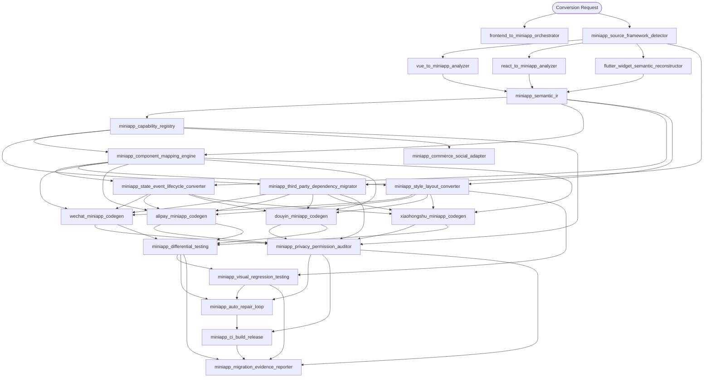

# 技能依赖图

依赖表示“消费其输出契约”，不表示一次任务必须执行所有分支。Orchestrator 根据实际源框架和目标平台裁剪图。



## 分阶段视图

```text
Discovery
  miniapp-source-framework-detector

Source Analysis
  vue-to-miniapp-analyzer
  react-to-miniapp-analyzer
  flutter-widget-semantic-reconstructor

IR
  miniapp-semantic-ir

Planning
  miniapp-capability-registry
  miniapp-component-mapping-engine
  miniapp-state-event-lifecycle-converter
  miniapp-style-layout-converter
  miniapp-third-party-dependency-migrator
  miniapp-commerce-social-adapter

Target Generation
  wechat-miniapp-codegen
  alipay-miniapp-codegen
  douyin-miniapp-codegen
  xiaohongshu-miniapp-codegen

Validation
  miniapp-differential-testing
  miniapp-visual-regression-testing
  miniapp-privacy-permission-auditor

Repair
  miniapp-auto-repair-loop

Delivery and Evidence
  miniapp-ci-build-release
  miniapp-migration-evidence-reporter
```

## 动态裁剪规则

- 只检测到 Vue 时，不调用 React/Flutter analyzer。
- 只选择微信目标时，不执行其余三个 generator，但 capability registry 仍可报告跨平台可移植性。
- 不含商业、身份或社交能力时，commerce-social adapter 可标记不适用。
- 不执行上传/发布时，CI skill 只运行 build/preview 级别。
- 自动修复只在存在可重现 finding、回滚点和剩余重试预算时进入。
- evidence reporter 在每个阶段都可增量执行，最终执行依赖全部适用门禁。

## 无环约束

`skill-manifest.yaml` 中的 `depends_on` 必须形成 DAG。`scripts/verify_package.py` 会检测：

- 不存在的依赖；
- 自依赖；
- 环；
- 重复技能名；
- manifest 与目录不一致。

新增技能时必须同时更新 manifest、依赖图、任务文档和测试。
