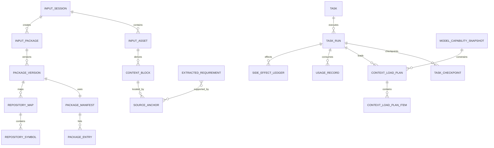

# Data Model

This is a logical model. Adapt names and types to the existing Elmos database; do not blindly create duplicate tables.

## 1. Conventions

Every tenant-owned table should include, where applicable:

```text
id (UUID/ULID)
tenant_id
project_id
created_at / updated_at
created_by
version
status
trace_id
deleted_at or retention state
```

Use immutable version rows for original assets, manifests, package versions, content blocks, source anchors, decisions and checkpoints. Mutable projection tables may point to the current version.

## 2. Input and upload

| Table | Purpose | Important keys / invariants |
|---|---|---|
| `input_sessions` | User submission envelope | tenant/project, state, requested role, idempotency key |
| `input_assets` | Immutable original asset identity | content hash, object key, MIME, size, security state |
| `asset_versions` | New/replaced versions | never overwrite original bytes |
| `upload_sessions` | Large-file upload | server-confirmed state, expiry, quota reservation |
| `upload_parts` | Multipart parts | unique(upload_session_id, part_number), checksum |
| `folder_input_sessions` | Folder scan/upload | root display names only, no local absolute path |
| `folder_entries` | Client manifest entries | normalized relative path, original display path |
| `input_packages` | Logical bundle | current version pointer, readiness/completeness |
| `input_package_versions` | Immutable package version | parent, manifest digest, analysis view |
| `package_manifests` | Canonical entry set | deterministic digest/Merkle root |
| `package_entries` | File/dir/link/archive entries | unique(manifest_id, normalized_path) |
| `package_manifest_views` | Included/excluded analysis view | policy and rule version |
| `package_upload_sessions` | Multi-file negotiation | missing/reused/failed counters |
| `package_file_uploads` | Per-file state | expected/actual hash, server offset |
| `package_file_parts` | Per-file multipart | idempotent part key |

## 3. Processing and security

| Table | Purpose |
|---|---|
| `processing_jobs` | Durable stage jobs and attempts |
| `processing_checkpoints` | Stage recovery state |
| `provider_executions` | Parser/OCR/ASR/LLM call, usage, receipt |
| `security_findings` | Generic finding and severity |
| `package_security_findings` | Package/entry association |
| `package_secret_findings` | Secret/PII metadata with redacted preview |
| `archive_inspections` | Archive format, encryption, declared sizes |
| `archive_entries` | Pre-scan entry metadata |
| `archive_extraction_jobs` | Sandboxed extraction run |
| `archive_password_sessions` | Ephemeral secret handle metadata only |
| `archive_resource_counters` | Actual cumulative resource usage |
| `archive_safety_checks` | Per-entry decision and stable code |
| `malware_scan_runs` | Scanner/version/signature/result |
| `quarantine_actions` | Isolation/release/delete action and approval |

Sensitive values and passwords must not be stored in these tables.

## 4. Parsed content and provenance

| Table | Purpose |
|---|---|
| `content_documents` | Parser-level logical document |
| `content_blocks` | Versioned multimodal block |
| `content_block_relations` | parent/child, reading order, references |
| `source_anchors` | Page/time/bbox/line/symbol locator |
| `content_derivations` | raw → parsed → corrected → fused lineage |
| `audio_segments` | speaker/time/text/confidence |
| `document_pages` | page dimensions/route/OCR state |
| `document_tables` | logical table and cell graph |
| `visual_elements` | UI/diagram/OCR polygon |
| `user_corrections` | Versioned human correction |
| `content_quality_scores` | confidence and validation evidence |

A `content_block` that drives a key requirement must have at least one valid `source_anchor`.

## 5. Requirements, entities and fusion

| Table | Purpose |
|---|---|
| `extracted_requirements` | Versioned functional/nonfunctional requirement |
| `requirement_sources` | many-to-many requirement ↔ source anchor |
| `extracted_entities` | role/system/module/API/data entity |
| `content_relations` | semantic relation/data flow/dependency |
| `input_conflicts` | conflicting statements and resolution state |
| `conflict_statements` | value/source/version for each side |
| `decisions` | approved/rejected/superseded decision |
| `decision_sources` | decision evidence |
| `review_tasks` | low confidence/conflict/security review |

Resolution creates a decision version; it never deletes opposing source statements.

## 6. Search, memory and repository maps

| Table | Purpose |
|---|---|
| `index_versions` | Full-text/vector/symbol index snapshot |
| `index_documents` | Source-aware searchable projection |
| `project_memory_items` | Versioned fact/decision/task memory |
| `memory_relations` | fact relations and supersession |
| `memory_deletion_jobs` | deletion propagation |
| `package_project_roots` | root candidates/approved roots |
| `package_language_profiles` | languages and evidence |
| `package_framework_profiles` | frameworks/build systems and evidence |
| `package_ignore_rules` | rule source/version/priority |
| `package_entry_classifications` | Included/Generated/Vendored/etc. |
| `repository_maps` | map snapshot per package version |
| `repository_modules` | module/service nodes |
| `repository_symbols` | symbol with source range |
| `repository_dependencies` | typed edges with confidence |
| `repository_context_maps` | L0-L5 context projection |
| `repository_map_nodes` | context-map nodes and summaries |
| `repository_map_edges` | context/impact edges |

All index rows need tenant/project/package-version fields even if the backing engine also uses namespaces.

## 7. Context

| Table | Purpose |
|---|---|
| `model_capabilities` | Current model capability projection |
| `model_capability_snapshots` | Immutable historical capability |
| `model_capability_sources` | Source and trust status |
| `model_probe_runs` | Boundary probes |
| `task_context_budgets` | Effective budget by task/model |
| `token_estimates` | Estimated/measured tokens by source |
| `context_usage_snapshots` | Current context composition |
| `context_candidates` | Candidate evidence |
| `context_load_plans` | Immutable load plan |
| `context_load_plan_items` | included/deferred/evicted item |
| `context_pinned_items` | P0/P1 and explicit pin |
| `context_pressure_snapshots` | ratio and forecast |
| `context_pressure_transitions` | state changes |
| `context_compaction_runs` | algorithm/input/output/evidence |
| `compaction_checkpoints` | structured compacted state |
| `context_rehydration_runs` | exact retrieval attempts |
| `context_integrity_checks` | pre/post transform report |
| `critical_fact_sets` | facts that must survive |
| `critical_fact_items` | typed critical facts |
| `context_eviction_events` | what left and why |

Do not store only a percentage; retain component token counts and the model capability snapshot id.

## 8. Durable tasks, effects and cost

| Table | Purpose |
|---|---|
| `tasks` | Top-level user task |
| `task_runs` | Attempt/run |
| `task_nodes` | Workflow nodes |
| `task_checkpoints` | Recoverable task state |
| `recovery_attempts` | Resume/replay/rollback |
| `side_effect_ledger` | External effect idempotency and receipt |
| `outbox_events` | Transactional event delivery |
| `webhook_deliveries` | Signed delivery/retry |
| `task_progress_snapshots` | Durable user progress |
| `eta_predictions` | prediction and feature version |
| `usage_records` | provider/compute/storage/network usage |
| `cost_ledger_entries` | estimated/reserved/actual/reconciled cost |
| `billing_entries` | price/revenue/discount/tax if in scope |

Unique constraints should prevent duplicate effect and duplicate usage accounting, for example:

```text
unique(tenant_id, provider, provider_request_id)
unique(task_run_id, tool_name, idempotency_key)
unique(upload_session_id, part_number)
unique(manifest_id, normalized_path)
```

## 9. Retention and audit

| Table | Purpose |
|---|---|
| `retention_policies` | Tenant/project/data-class rules |
| `retention_holds` | Legal/security hold |
| `deletion_requests` | User/admin deletion |
| `deletion_jobs` | Propagation over objects/indexes/derivatives |
| `audit_events` | Immutable security/business audit |
| `access_events` | Sensitive asset access |
| `policy_versions` | Runtime policy snapshots |

A deletion completes only after object, preview, derived block, index, cache and memory propagation is reconciled, subject to holds.

## 10. Relationship summary


