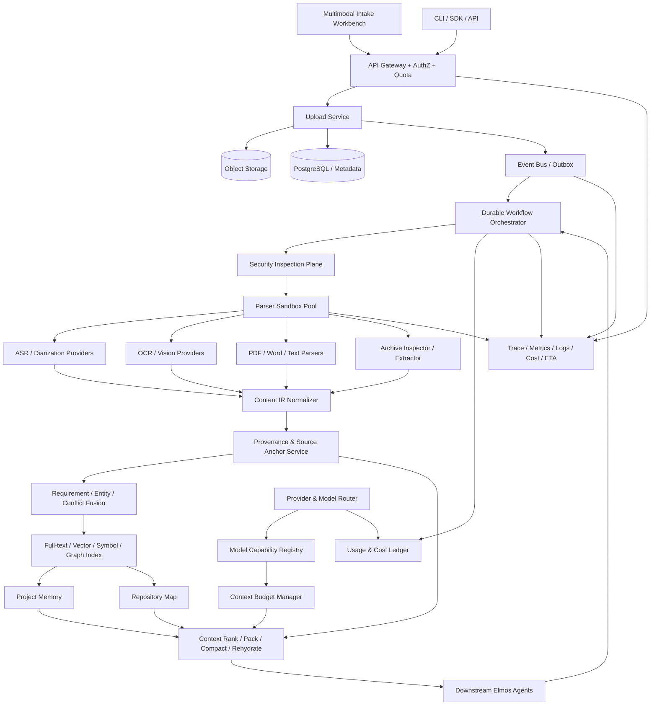
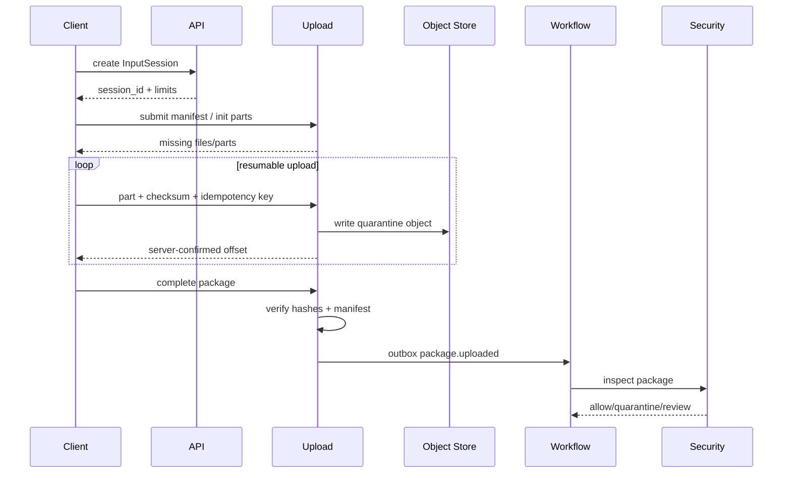
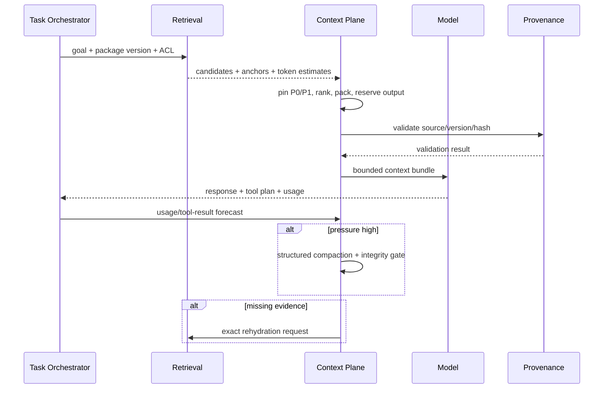

# Reference Architecture

## 1. Architecture goals

- Multimodal parsers are replaceable providers behind stable contracts.
- Raw assets remain immutable; every derivative carries lineage.
- Large corpora are stored and indexed outside the model window.
- Durable orchestration owns state; clients only subscribe to progress.
- Ingestion and code execution are separate trust domains.
- Tenant/project/version isolation is enforced at storage, query, event, cache and trace layers.
- Cost, ETA, source coverage and integrity are first-class outputs.

## 2. Logical architecture

## 3. Trust zones

| Zone | Examples | Network | Writable storage | May execute user code? |
|---|---|---|---|---|
| Edge | Web/CLI/API Gateway | public ingress only | transient request buffers | No |
| Upload | multipart and manifest services | object/metadata only | quarantine object prefix | No |
| Inspection | AV, MIME, archive pre-scan | deny-by-default egress | ephemeral scratch | No |
| Parser Sandbox | PDF/Office/OCR helpers | provider allowlist or no egress | ephemeral capped volume | No |
| Indexing | IR, provenance, text/vector/symbol | internal services | versioned derived stores | No |
| Agent Control | context, route, tool gateway | approved provider/tool egress | task/checkpoint stores | Only through separate execution sandbox |
| Code Execution | build/test sandbox | explicit dependency policy | disposable workspace | Yes, constrained |
| Governance | audit, retention, cost | internal only | immutable/controlled records | No |

A parser sandbox must never be reused as a code execution sandbox.

## 4. Service boundaries

### 4.1 API Gateway / Identity

Owns authentication, tenant/project authorization, request limits, idempotency header validation and trace creation. It does not parse files.

### 4.2 Upload Service

Owns `InputSession`, upload negotiation, multipart state, hashes, quotas and object commit. Objects are first written to a quarantine namespace; only a verified manifest can advance.

### 4.3 Security Inspection Plane

Performs MIME/magic/structure checks, antivirus, macro/script detection, secret/PII classification and archive safety decisions. Findings are append-only and versioned.

### 4.4 Durable Workflow Orchestrator

Owns the authoritative stage state, retries, timeouts, checkpoints, compensation and progress. Queue messages are notifications, not the authoritative state.

### 4.5 Parser Sandbox Pool

Workers are selected by content type and risk. Each worker receives a read-only input handle and a capped output area, produces parser evidence and is destroyed after completion.

### 4.6 Content IR and Provenance

Normalizes provider-specific output into `ContentBlock`, structural relations and `SourceAnchor`. It maintains lineage from raw bytes through corrections and fused facts.

### 4.7 Fusion and Requirement Service

Deduplicates, associates versions, extracts requirements/entities/relations, detects conflicts and produces review tasks. It does not silently resolve contradictions.

### 4.8 Index and Project Memory

Maintains full-text, vector, symbol, graph, temporal and metadata indexes. Every index entry includes tenant/project/package version and source identity. Project memory stores versioned facts and decisions, not opaque chat summaries.

### 4.9 Model Capability and Routing

`ModelCapabilityRegistry` stores versioned provider/model capabilities. `ProviderRouter` chooses parser/model based on privacy, modality, accuracy, cost, latency and tenant policy.

### 4.10 Context Plane

`ContextBudgetManager` calculates effective input capacity. Ranking/packing selects evidence. Pressure monitoring triggers compaction. Integrity gates verify facts. Rehydration loads original evidence.

### 4.11 Downstream Agent Adapter

Provides a stable `TaskContextBundle` to project generation, conversion, testing, architecture and repair agents. It exposes citations, conflicts, version and completeness; it never claims all corpus content is resident in the model window.

### 4.12 Observability and Cost

Every stage emits trace spans and usage records. Cost ledger reconciles estimates with provider actuals. ETA service learns from stage history and reports machine wall-clock forecasts.

## 5. Storage model

| Data | Recommended store | Characteristics |
|---|---|---|
| Raw assets/archives | Object storage | immutable, encrypted, content hash, quarantine/approved prefixes |
| Extracted pages/audio chunks/previews | Object storage | derived version, retention-linked |
| Metadata/state/ACL | PostgreSQL | transaction, RLS/tenant key, migrations |
| Event delivery | Outbox + broker | at-least-once, idempotent consumers |
| Full text | Search engine/Postgres FTS | tenant/version filters |
| Vectors | vector index | source/ACL filters mandatory |
| Repository symbols/graphs | Postgres/graph store | versioned nodes/edges |
| Checkpoints | PostgreSQL + object storage | atomic metadata + larger immutable payload |
| Secrets/passwords | secret manager/ephemeral channel | never general DB/log/model |
| Metrics/traces | observability backend | content-minimized, tenant-aware |
| Cost ledger | relational append ledger | idempotent usage keys, reconciliation |

## 6. Critical flows

### 6.1 File or folder upload

### 6.2 Long-context task

### 6.3 Recovery

1. Write intent and idempotency key.
2. Persist pre-side-effect checkpoint.
3. Execute through tool gateway.
4. Record provider/tool receipt.
5. Persist side-effect ledger and post-checkpoint atomically.
6. On retry, reconcile receipt before re-executing.
7. Resume from the last compatible checkpoint.
8. Recalculate model context and validate integrity before continuing.

## 7. Deployment guidance

- Start as a modular monolith plus worker pools if Elmos is early-stage; do not create dozens of microservices solely to match this diagram.
- Split security sandbox, heavy parser workers and code execution early because they have different trust/resource profiles.
- Partition queues by workload class and tenant fairness; reserve capacity for interactive tasks.
- Use content-addressed objects and immutable package versions to make retries cheap.
- Autoscale on queue age, weighted CPU/GPU demand and tenant concurrency, not only raw message count.
- The user-facing progress stream is reconstructed from durable state after reconnect.

## 8. Required architecture decisions before production

- Database and tenant isolation strategy;
- workflow engine and outbox implementation;
- object-store encryption and deletion model;
- parser sandbox technology;
- provider privacy and regional routing;
- index technology and ACL enforcement;
- model capability synchronization;
- cost attribution and billing boundary;
- disaster recovery RPO/RTO;
- code execution trust boundary.
