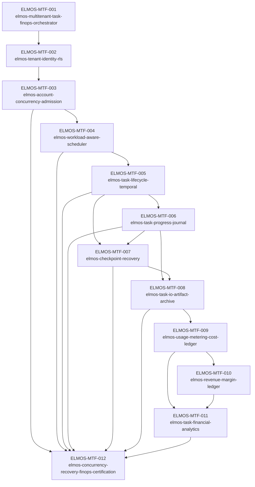

# Dependency Graph

## Existing Elmos dependencies

The orchestrator also integrates with existing infrastructure Skills including identity/tenant security, Temporal reliability, runner scheduling, caching, observability/FinOps, backup/recovery, scale certification, runtime cost estimation, and commercial packaging.
