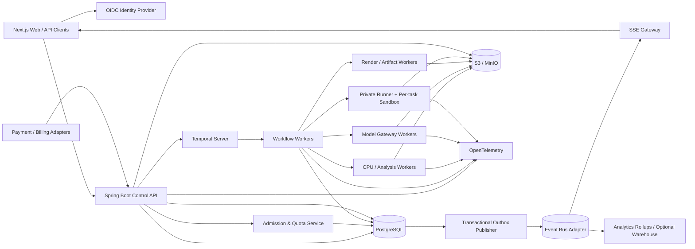

# Reference Architecture

## 1. Planes and ownership

| Plane | Responsibilities | Authoritative data |
|---|---|---|
| Browser / Client | Submit, control, view progress/results, authorized analytics | None |
| Control Plane | Identity, authorization, task API, admission, quotas, current projections | PostgreSQL |
| Workflow Plane | Durable orchestration, timers, signals, retries, cancellation, Continue-As-New | Temporal history |
| Execution Plane | Workload workers, model gateway, private runner, sandbox, tools | Ephemeral execution plus durable receipts/checkpoints |
| Artifact Plane | Inputs, outputs, logs, reports, code, evidence, versions | S3-compatible object storage |
| Event Plane | Outbox publication, fan-out, UI update, downstream projections | PostgreSQL outbox until delivered |
| FinOps Plane | Usage ledger, price book, cost aggregation, budgets | PostgreSQL |
| Billing Plane | Revenue entries, allocations, settlements, margin | PostgreSQL |
| Analytics Plane | Rebuildable operational and commercial rollups | PostgreSQL rollups or replaceable analytical store |
| Observability Plane | Logs, metrics, traces, SLOs, alerts | OpenTelemetry backends |

## 2. Component diagram



## 3. Request path

### Submit

1. API verifies JWT and resolves tenant membership.
2. API starts a database transaction and sets transaction-local identity context.
3. API validates the task request and `Idempotency-Key`.
4. API stores immutable task and input manifest references.
5. Admission service attempts an account slot claim.
6. If a slot is available and tenant/platform gates pass, task becomes `ADMITTED`.
7. Otherwise task becomes `WAITING_FOR_SLOT` with one or more durable reasons.
8. API commits task, slot decision, audit, and outbox event.
9. Outbox starter starts the deterministic Temporal workflow for admitted tasks.
10. API returns task state and concurrency snapshot.

### Execute

1. Temporal workflow reads typed task/run context.
2. Workflow writes `NodeScheduled` through an Activity.
3. The workload-specific worker executes within bounded concurrency.
4. Worker emits heartbeats asynchronously and critical transitions durably.
5. Model/tool/storage adapters emit idempotent usage events.
6. Safe node completion commits node state, artifact references, side-effect receipt, usage acknowledgement, checkpoint, task event, and outbox event.
7. Progress projector updates current snapshots and UI stream.
8. Workflow proceeds, pauses, retries, cancels, reconciles, or terminates.

### Complete

1. Final artifacts and output manifest are verified.
2. Final usage events are flushed and task cost is finalized.
3. Applicable revenue is directly mapped or allocated.
4. Task becomes `SUCCEEDED`, `FAILED`, or `CANCELLED`.
5. Account slot is released using matching lease generation.
6. Scheduler promotes the next eligible queued task.
7. Analytical rollups update asynchronously.

## 4. Concurrency model

### Layer 1 — hard account root-task slots

- Scope: authenticated account across all tenant memberships.
- Maximum: exactly three.
- Storage: `account_task_slot` rows 1, 2, 3.
- Claim: atomic row lock and lease generation.
- Purpose: user/account fairness and product constraint.

### Layer 2 — tenant quotas

- maximum active tasks;
- maximum queued tasks;
- maximum concurrency units;
- model/provider request and token budgets;
- monthly cost budget;
- workload-class limits.

### Layer 3 — platform capacity

- worker-pool concurrency;
- CPU/memory/GPU resources;
- runner/site capacity;
- model-provider rate limits;
- object-store and database health;
- maintenance and incident gates.

### Layer 4 — node fan-out

A root task may fan out into many nodes. Node concurrency is separately bounded by:

- workflow/task-queue worker limits;
- per-task fan-out limit;
- per-tenant resource units;
- dependency graph;
- external-provider quotas;
- cost budget.

## 5. Storage ownership

| Data | Owner | Notes |
|---|---|---|
| Task request/current state | PostgreSQL | Immutable request plus current projection |
| Workflow history/timers/signals | Temporal | Not the business analytics source |
| Progress events | PostgreSQL | Append-only; published through outbox |
| Progress snapshot | PostgreSQL | Rebuildable |
| Checkpoints/receipts | PostgreSQL + object storage | Metadata in DB, large state in object storage |
| Inputs/outputs/logs/artifacts | Object storage | Content-addressed, encrypted, versioned |
| Usage/cost ledger | PostgreSQL | Append-only |
| Revenue/allocation ledger | PostgreSQL | Append-only |
| Analytics rollups | PostgreSQL/warehouse | Rebuildable |
| Traces/metrics | Observability backend | Correlated by IDs |

## 6. Identifier contract

Every relevant record or telemetry item should carry the applicable subset:

```text
tenant_id
account_id
project_id
task_id
task_run_id
workflow_id
node_key
node_attempt_id
checkpoint_id
artifact_id
event_id
transition_id
usage_event_id
revenue_entry_id
trace_id
request_id
idempotency_key
provider_receipt_id
```

Identifiers are server-generated except the client `Idempotency-Key`, which is scoped and validated.

## 7. Event delivery

The transactional outbox ensures the database change and publication intent commit together. Delivery is at-least-once; consumers must be idempotent.

Recommended initial implementation:

```text
PostgreSQL transaction
  -> outbox_event
  -> publisher with SKIP LOCKED
  -> configured bus adapter
  -> SSE/analytics/notification consumers
```

At higher scale, the publisher may be replaced by CDC while preserving the event contract.

## 8. Progress persistence split

### Synchronous durable path

- state transition;
- node terminal status;
- checkpoint;
- side-effect receipt;
- artifact manifest;
- usage/revenue ledger acknowledgement;
- audit.

### Asynchronous path

- heartbeat;
- log segment flush;
- fine progress delta;
- non-critical telemetry;
- analytical projection.

A bounded buffer must flush on node completion, graceful shutdown, pause, cancellation, and checkpoint.

## 9. Failure domains and responses

| Failure | Response |
|---|---|
| Client disconnect | Task continues; reconnect through task API/SSE replay |
| API crash after DB commit | Outbox starter/publisher resumes |
| Temporal unavailable | Task remains durable; starter retries |
| Duplicate start | Deterministic workflow ID and CAS/outbox make it idempotent |
| Worker crash before side effect | Retry from heartbeat/checkpoint |
| Worker crash after side effect | `UNKNOWN_RESULT` → reconcile receipt/provider/workspace |
| Runner lease expiry | Reaper marks unknown and fences stale generation |
| Event bus outage | Outbox accumulates; task truth remains in DB |
| Object store outage | Retry; do not mark artifact complete without verified object |
| Provider timeout | Classify; reconcile provider receipt before retry |
| Price change | Existing usage keeps snapshotted price |
| Payment refund | Append signed refund/recognition adjustments |
| Analytics corruption | Delete projection and rebuild from ledgers |

## 10. Deployment recommendation

The existing Elmos modular-monolith-first control plane can retain a single Spring Boot deployment initially, provided modules and database ownership are explicit. Scale out first by:

- multiple stateless API replicas;
- dedicated Temporal workflow workers;
- workload-specific activity worker deployments;
- private runner sites;
- separate outbox publisher;
- separate progress/analytics projectors.

Split into independent services only when deployment scaling, ownership, or fault isolation requires it.

## 11. Required telemetry

- account active slots, slot claim latency, stale slot count;
- tenant active tasks and resource-unit utilization;
- queue depth, queue age, admission reason;
- workflow start lag, stuck workflow, Continue-As-New count;
- node latency, retry, cancellation, recovery;
- runner lease age, expiry, unknown result, reconciliation;
- outbox backlog and publication lag;
- progress event rate and UI lag;
- object upload latency and integrity failure;
- model tokens and provider rate-limit errors;
- task estimated/actual cost and variance;
- recognized revenue, collected cash, gross profit, margin;
- financial unreconciled amount and age;
- database, Temporal, object store, worker, and event-bus health.
