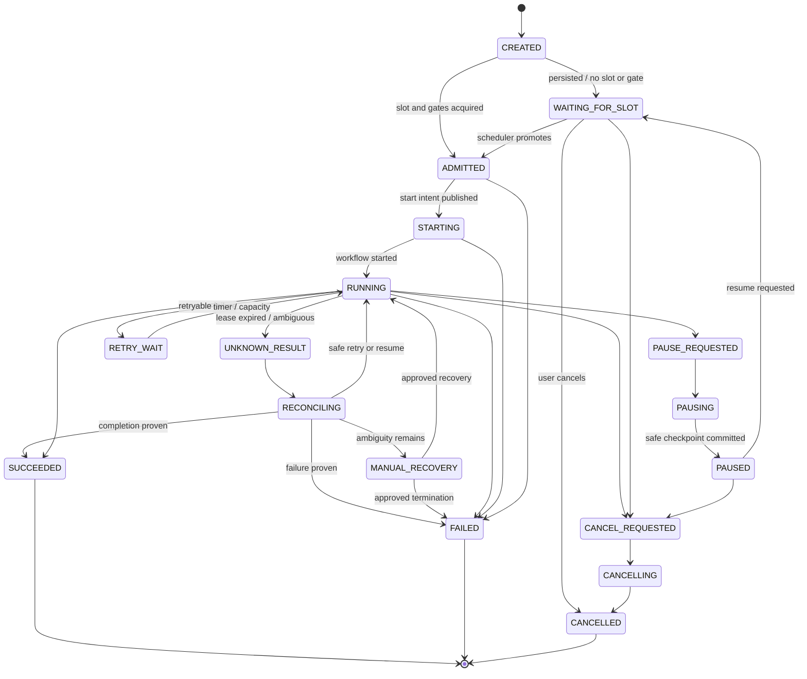

# Task State Machine

## 1. Root task states



## 2. Slot consumption

| State | Consumes account slot? | Notes |
|---|---:|---|
| `CREATED` | No | Very short persisted state |
| `WAITING_FOR_SLOT` | No | Durable queue |
| `ADMITTED` | Yes | Slot claim committed |
| `STARTING` | Yes | Start intent/workflow startup |
| `RUNNING` | Yes | Active execution |
| `PAUSE_REQUESTED` | Yes | Work may still be active |
| `PAUSING` | Yes | Slot released only after safe pause checkpoint |
| `PAUSED` | No | Resume must reacquire a slot |
| `RETRY_WAIT` | No by default | Reacquire before retry; policy may retain for a very short backoff |
| `CANCEL_REQUESTED` | Yes if work/lease remains active | |
| `CANCELLING` | Yes if work/lease remains active | |
| `UNKNOWN_RESULT` | No after lease expiry | Reaper fences stale generation |
| `RECONCILING` | Conditional | Yes only if an active execution lease is retained |
| `MANUAL_RECOVERY` | No | Explicit operator action needed |
| `SUCCEEDED` | No | Terminal |
| `FAILED` | No | Terminal |
| `CANCELLED` | No | Terminal |

The slot record is the authoritative determination. State and slot reconciliation runs continuously and alerts on impossible combinations.

## 3. Legal transition rules

Every transition requires:

- expected current state or version;
- transition ID;
- actor/source;
- reason code;
- task/run identifiers;
- optional node/attempt/checkpoint/receipt;
- trace and request IDs;
- state-specific preconditions.

A transition commits:

1. current projection update;
2. task event append;
3. audit event if required;
4. slot/lease change if required;
5. outbox publication intent;
6. checkpoint/receipt/artifact/usage references where applicable.

## 4. Node states

```text
PLANNED
BLOCKED
READY
SCHEDULED
LEASED
RUNNING
CHECKPOINTING
PAUSE_REQUESTED
PAUSED
RETRY_WAIT
CANCEL_REQUESTED
UNKNOWN_RESULT
RECONCILING
SUCCEEDED
FAILED
CANCELLED
SKIPPED
```

A node's terminal output is immutable. A retry creates a new `task_node_attempt`.

## 5. Attempt and lease

Attempt identity:

```text
(task_run_id, node_key, attempt_no, lease_generation)
```

Every runner callback carries all four. A callback with a stale attempt or generation is rejected and audited.

Lease lifecycle:

```text
READY
  -> LEASED(generation=N, expires_at)
  -> RUNNING
  -> renew(generation=N)
  -> complete/fail/checkpoint(generation=N)
```

Expiry:

```text
RUNNING + expires_at < now
  -> UNKNOWN_RESULT
  -> RECONCILING
```

The reaper never directly retries externally side-effecting work.

## 6. Pause

1. User requests pause.
2. API commits `PAUSE_REQUESTED` and signals Temporal.
3. Workflow stops scheduling new nodes.
4. Running nodes reach a declared safe point or report not-pausable.
5. Critical progress/log buffers flush.
6. Checkpoint commits.
7. Task becomes `PAUSED`.
8. Slot releases.
9. Resume request moves task to `WAITING_FOR_SLOT`.
10. On admission, compatibility validation runs before work resumes.

## 7. Cancel

1. API commits `CANCEL_REQUESTED`.
2. Temporal cancellation propagates to Activities.
3. Runner receives cancellation with attempt and lease generation.
4. Nodes stop at safe cancellation points.
5. Side effects already completed remain recorded; compensations are explicit workflows.
6. Task becomes `CANCELLED` only after active leases are ended or reconciled.
7. Slot releases.

## 8. Retry

Retryability is based on an error taxonomy, not a blanket count:

| Error class | Default |
|---|---|
| transient network/provider | retry with bounded exponential backoff |
| provider rate limit | retry using retry-after and quota gate |
| worker crash before side effect | retry/resume |
| unknown result after side effect | reconcile first |
| invalid user input | non-retryable |
| policy/security denial | non-retryable without approved override |
| deterministic build/test failure | workflow may invoke repair policy; bounded loops |
| budget exceeded | pause/fail pending authorized budget change |
| incompatible checkpoint | fork new run |
| schema/workflow bug | fail and operator remediation |

## 9. Terminal semantics

`SUCCEEDED` means:

- all required nodes succeeded or were approved as skipped;
- final output/artifact manifest is verified;
- final critical usage events are flushed;
- final checkpoint/evidence is committed;
- slot is released.

`FAILED` means:

- no supported automated recovery remains;
- failure classification and last compatible checkpoint are recorded;
- partial outputs and cost remain queryable;
- slot is released.

`CANCELLED` means:

- cancellation completed or ambiguity was reconciled;
- active execution leases ended;
- already incurred cost remains posted;
- partial outputs remain according to policy;
- slot is released.

## 10. Reconciliation invariants

A background reconciler checks:

- slot occupied by terminal/nonexistent task;
- active state without slot;
- slot lease expired without unknown/recovery state;
- workflow running without task run;
- task run active without Temporal workflow/search attribute;
- node running without valid attempt/lease;
- checkpoint referenced but object missing/hash mismatch;
- cost summary differing from usage ledger;
- revenue allocation exceeding source amount;
- outbox event permanently failed;
- analytics watermark behind ledger retention boundary.
