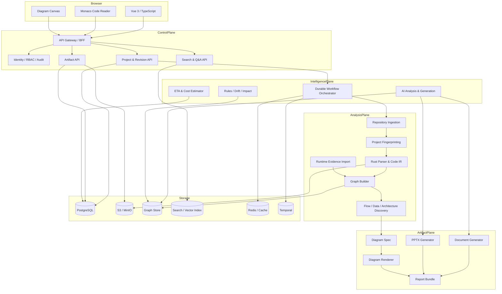
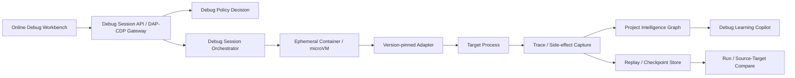

# 生产级参考架构

## 1. 逻辑架构

## 2. 推荐技术栈

| 层 | 默认选择 | 可替换边界 |
|---|---|---|
| Web | Vue 3、TypeScript、Vite、Monaco | React 可作为独立适配 |
| 图表画布 | Cytoscape.js/Vue Flow、BPMN.io、Markmap、ELK | Renderer Adapter |
| 企业 API/BFF | Java 21+、Spring Boot | Go/Rust Adapter |
| 解析核心 | Rust、Tree-sitter、语言编译器/LSP | Parser Registry |
| AI 编排 | Python、FastAPI、LangGraph | Agent Runtime Adapter |
| 长任务 | Temporal | Durable Workflow Port |
| 元数据 | PostgreSQL | JDBC/SQL Repository |
| 图谱 | Neo4j/Memgraph/Apache AGE 之一 | Graph Repository Port |
| 搜索 | OpenSearch；小规模可 PostgreSQL FTS + pgvector | Search Adapter |
| Blob | S3/MinIO | Object Store Port |
| Cache | Redis + Object Store | Cache Adapter |
| Event | Kafka/Redpanda/NATS JetStream | Event Bus Port |
| Observability | OpenTelemetry、Prometheus、Loki/OTLP | Telemetry Port |
| PPTX | PptxGenJS 或受控 Python 生成器 | Presentation Renderer |
| DOCX/PDF | Pandoc/HTML pipeline 或受控生成器 | Document Renderer |

## 3. 服务目录

### `insight-web`

- 项目总览、代码阅读、架构、流程、数据、API/事件；
- 图表、文档、PPT、报告、影响、风险、转换对比；
- 任务中心、证据查看、审批、设置；
- 不保存长期 Git/模型密钥。

### `insight-api`

- Tenant、Project、Repository、Revision；
- Artifact、Review、Share、Audit；
- REST/BFF、SSE/WebSocket 任务事件；
- 统一授权、配额、幂等和错误模型。

### `repository-ingestion`

- Git/ZIP/本地/Elmos 暂存项目；
- 内容寻址、manifest、子模块、LFS；
- 密钥扫描、排除和配额；
- 不执行仓库脚本。

### `analyzer-core`

- 项目指纹；
- 多语言 Parser Registry；
- Code IR、Symbol、Reference、Call Graph；
- 可分片、可增量、可容错。

### `intelligence-graph`

- Code、Architecture、Function、Flow、Data、Deployment、Security、Test、Evidence；
- 图谱投影与 revision diff；
- 人工 override 和置信度。

### `intelligence-worker`

- 代码/架构讲解；
- 流程、功能、风险、文档、PPT 内容生成；
- 混合检索、重排、事实清单；
- 模型路由、Prompt 版本和安全过滤。

### `artifact-service`

- Diagram Spec；
- 图表渲染；
- 文档/PPT/报告版本；
- 人工锁定、三方合并、导出和签名。

### `workflow-service`

- durable workflow；
- 检查点、租约、暂停、恢复、取消；
- 缓存失效和外部副作用幂等；
- 机器 ETA 预测与重估。

## 4. 数据所有权

| 数据 | 主存储 | 可重建 |
|---|---|---|
| Tenant/Project/Revision/Job | PostgreSQL | 否 |
| Blob/Source snapshot/Generated file | Object Store | 部分 |
| Code IR shard | Object Store | 是 |
| Intelligence Graph | Graph Store | 是 |
| Search/Vector index | Search Store | 是 |
| Artifact metadata/version/lock | PostgreSQL | 否 |
| Artifact binary | Object Store | 可由源部分重建 |
| Evidence/Claim | PostgreSQL + Object Store | 关键部分否 |
| Cache | Redis/Object Store | 是 |
| Workflow history | Temporal backend | 否 |
| Audit | Append-only store/PostgreSQL | 否 |

## 5. 可靠性原则

- 所有 worker 均可被杀死后重启；
- 任务阶段以不可变输入 manifest 启动；
- 所有外部写操作具备幂等键；
- Graph/Search 是投影，可从原始 IR 和 Evidence 重建；
- Artifact version 只能追加，认证版本不可原地修改；
- 跨服务事件使用 outbox/inbox 或等价一致性模式；
- 取消不等于删除，须保留审计和已确认产物。

## 6. 多租户边界

- 每个数据实体包含 `tenant_id`；
- Repository/Graph/Search/Object key 均包含租户隔离域；
- 权限过滤在服务端和查询层执行；
- 模型上下文只包含调用者有权访问的数据；
- 缓存禁止跨租户复用内容，公共 parser 二进制除外；
- 企业可选择独立数据库、独立 KMS、独立模型和独立网络。

## 8. Debug Plane

控制面、适配器和目标进程分离。运行面仅获得短期、最小权限凭据；所有会话由租约、配额、网络策略和 cleanup attestation 约束。
